# Step1笔记总结

## 学号：201809009  姓名：王征宇

## 神经网络概论与基本概念

**概论**

- 人工智能发展简史
- 人工智能的定义
- 范式的演化

**基本概念**

- 神经网络的基本工作原理
- 反向传播
- 梯度下降
- 线性反向传播
- 非线性反向传播
- 梯度下降
- 损失函数
    -均方差损失函数
    -交叉熵损失函数

### 人工智能发展简史

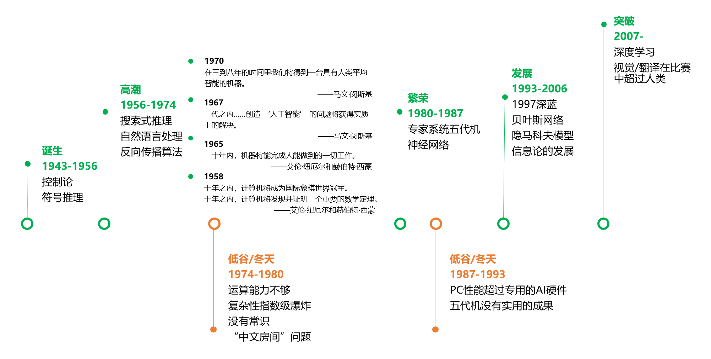

### 人工智能的定义

#### 第一个层面，人们对人工智能的**期待**可以分为：

- **智能地把某件特定的事情做好，在某个领域增强人类的智慧，这种方式又叫做智能增强**
- **像人类一样能认知，思考，判断：模拟人类的智能**

#### 第二个层面，**从技术的特点来看**。

1. 监督学习（Supervised Learning）
2. 无监督学习（Unsupervised Learning）
3. 强化学习（Reinforcement Learning）

综合来看，如果我们把机器学习当作一个小孩，那么，教育小孩的方式就有根据正确答案指导学习（监督学习）；根据小孩实践的过程给予各种鼓励（强化学习）；还有自由探索世界，让小孩自己总结规律（无监督学习）。

#### 第三个层面，**从应用的角度来看**，我们看到狭义人工智能在各个领域都取得了很大的成果。

- 翻译领域（微软的中英翻译超过人类）
- 阅读理解（SQuAD 比赛）
- 下围棋（2016）德州扑克（2019）麻将（2019）

### 范式的演化

#### 第一阶段：经验

从几千年前到几百年前，人们描述自然现象，归纳总结一些规律。

#### 第二阶段：理论

这一阶段，科学家们开始明确定义，速度是什么，质量是什么，化学元素是什么（不再是五行和燃素）……也开始构建各种模型，在模型中尽量撇除次要和无关因素

#### 第三阶段：计算仿真

从二十世纪中期开始，利用电子计算机对科学实验进行模拟仿真的模式得到迅速普及，人们可以对复杂现象通过模拟仿真，推演更复杂的现象，典型案例如模拟核试验、天气预报等。这样计算机仿真越来越多地取代实验，逐渐成为科研的常规方法。科学家先定义问题，确认假设，再利用数据进行分析和验证。

#### 第四阶段：数据探索

最后我们到了“数据探索”（Data Exploration）阶段。在这个阶段，科学家收集数据，分析数据，探索新的规律。在深度学习的浪潮中出现的许多结果就是基于海量数据学习得来的。有些数据并不是从现实世界中收集而来，而是由计算机程序自己生成

### 神经网络的基本工作原理

#### 神经元细胞的数学模型

神经网络由基本的神经元组成，下图就是一个神经元的数学/计算模型


由五部分组成：
（1）输入 input：(x1,x2,x3) 是外界输入信号，一般是一个训练数据样本的多个属性；
（2）权重 weights：(w1,w2,w3) 是每个输入信号的权重值。
（3）偏移 bias：从生物学上解释，在脑神经细胞中，一定是输入信号的电平/电流大于某个临界值时，神经元细胞才会处于兴奋状态，这个b实际就是那个临界值。
（4）求和计算 sum：$$Z = w1 \cdot x1 + w2 \cdot x2 + w3 \cdot x3 + b = \sum_{i=1}^m(w_i \cdot x_i) + b$$
（5）激活函数 activation：求和之后，神经细胞已经处于兴奋状态了，已经决定要向下一个神经元传递信号了，但是要传递多强烈的信号，要由激活函数来确定。

#### 神经网络的训练过程

##### 单层神经网络模型

- $(x_1,x_2,x_3)$ 是一个样本数据的三个特征值
- $(w_{11},w_{21},w_{31})$ 是 $(x_1,x_2,x_3)$ 到 $n1$ 的权重
- $(w_{12},w_{22},w_{32})$ 是 $(x_1,x_2,x_3)$ 到 $n2$ 的权重
- $b_1$ 是 $n1$ 的偏移
- $b_2$ 是 $n2$ 的偏移


##### 训练流程

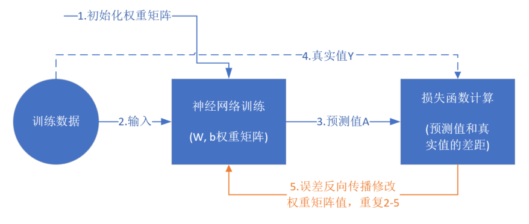

##### 前提条件

 1. 首先是我们已经有了训练数据；
 2. 我们已经根据数据的规模、领域，建立了神经网络的基本结构，比如有几层，每一层有几个神经元；
 3. 定义好损失函数来合理地计算误差。

##### 步骤

|Id|$x_1$|$x_2$|$x_3$|$Y$|
|---|---|---|---|---|
|1|0.5|1.4|2.7|3|
|2|0.4|1.3|2.5|5|
|3|0.1|1.5|2.3|9|
|4|0.5|1.7|2.9|1|

其中，$x_1,x_2,x_3$ 是每一个样本数据的三个特征值，$Y$ 是样本的真实结果值：

1. 随机初始化权重矩阵，可以根据正态分布等来初始化。这一步可以叫做“猜”，但不是瞎猜；
2. 拿一个或一批数据作为输入，带入权重矩阵中计算，再通过激活函数传入下一层，最终得到预测值。在本例中，我们先用Id-1的数据输入到矩阵中，得到一个 $A$ 值，假设 $A=5$；
3. 拿到Id-1样本的真实值 $Y=3$；
4. 计算损失，假设用均方差函数 $Loss = (A-Y)^2=(5-3)^2=4$；
5. 根据一些神奇的数学公式（反向微分），把 $Loss=4$ 这个值用大喇叭喊话，告诉在前面计算的步骤中，影响 $A=5$ 这个值的每一个权重矩阵，然后对这些权重矩阵中的值做一个微小的修改（当然是向着好的方向修改，这一点可以用数学家的名誉来保证）；
6. 用Id-2样本作为输入再次训练（Go to 2）；
7. 这样不断地迭代下去，直到以下一个或几个条件满足就停止训练：损失函数值非常小；准确度满足了要求；迭代到了指定的次数。

##### 神经网络中的矩阵运算

下图是一个两层的神经网络，包含隐藏层和输出层，输入层不算做一层。

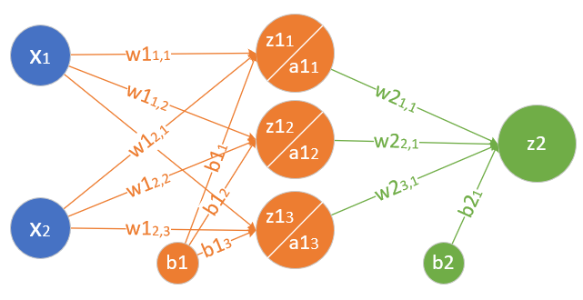

#### 神经网络的主要功能

##### 回归（Regression）或者叫做拟合（Fitting）

所谓回归或者拟合，其实就是给出x值输出y值的过程，并且让y值与样本数据形成的曲线的距离尽量小，可以理解为是对样本数据的一种骨架式的抽象。

##### 分类（Classification）

分类可以理解为是对两类或多类样本数据的边界的抽象

#### 激活函数的作用

如果我们不运用激活函数的话，则输出信号将仅仅是一个简单的线性函数。线性函数一个一级多项式。线性方程是很容易解决的，但是它们的复杂性有限，并且从数据中学习复杂函数映射的能力更小。一个没有激活函数的神经网络将只不过是一个线性回归模型罢了，不能解决现实世界中的大多数非线性问题。

没有激活函数，我们的神经网络将无法学习和模拟其他复杂类型的数据，例如图像、视频、音频、语音等。这就是为什么我们要使用人工神经网络技术，诸如深度学习，来理解一些复杂的事情，一些相互之间具有很多隐藏层的非线性问题。

### 反向传播与梯度下降的基本工作原理

1. 初始化；
2. 正向计算；
3. 损失函数为我们提供了计算损失的方法；
4. 梯度下降是在损失函数基础上向着损失最小的点靠近而指引了网络权重调整的方向；
5. 反向传播把损失值反向传给神经网络的每一层，让每一层都根据损失值反向调整权重；
6. Go to 2，直到精度足够好（比如损失函数值小于 $0.001$）。

### 线性反向传播

#### ①正向计算

假设我们有一个函数：

$$z = x \cdot y \tag{1}$$

其中:

$$x = 2w + 3b \tag{2}$$

$$y = 2b + 1 \tag{3}$$

计算图如下：

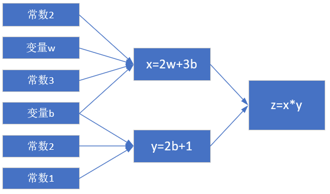

当w = 3, b = 4时，会得到如下结果：


#### ②反向传播求解w

##### 求w的偏导

我们从z开始一层一层向回看，图中各节点关于变量w的偏导计算结果如下：

$$因为z = x \cdot y，其中x = 2w + 3b，y = 2b + 1$$

所以：

$$\frac{\partial{z}}{\partial{w}}=\frac{\partial{z}}{\partial{x}} \cdot \frac{\partial{x}}{\partial{w}}=y \cdot 2=18 \tag{4}$$

其中：

$$\frac{\partial{z}}{\partial{x}}=\frac{\partial{}}{\partial{x}}(x \cdot y)=y=9$$

$$\frac{\partial{x}}{\partial{w}}=\frac{\partial{}}{\partial{w}}(2w+3b)=2$$

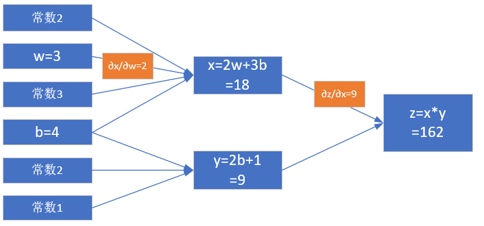

#### ③反向传播求解b


#### 反向传播求解b 代码总结

``` Python

def target_function(w,b):
    x = 2*w+3*b
    y=2*b+1
    z=x*y
    return x,y,z

def single_variable(w,b,t):
    print("\nsingle variable: b ----- ")
    error = 1e-5
    while(True):
        x,y,z = target_function(w,b)
        delta_z = z - t
        print("w=%f,b=%f,z=%f,delta_z=%f"%(w,b,z,delta_z))
        if abs(delta_z) < error:
            break
        delta_b = delta_z /63
        print("delta_b=%f"%delta_b)
        b = b - delta_b

    print("done!")
    print("final b=%f"%b)

if __name__ == '__main__':
    w = 3
    b = 4
    t = 150
    single_variable(w,b,t)    
```

#### 代码结果

``` C
single variable: b ----- 
w=3.000000,b=4.000000,z=162.000000,delta_z=12.000000
delta_b=0.190476
w=3.000000,b=3.809524,z=150.217687,delta_z=0.217687 
delta_b=0.003455
w=3.000000,b=3.806068,z=150.007970,delta_z=0.007970
delta_b=0.000127
w=3.000000,b=3.805942,z=150.000294,delta_z=0.000294
delta_b=0.000005
w=3.000000,b=3.805937,z=150.000011,delta_z=0.000011
delta_b=0.000000
w=3.000000,b=3.805937,z=150.000000,delta_z=0.000000
done!
final b=3.805937
```

#### ④同时求解w和b的变化值

这次我们要同时改变w和b，到达最终结果为z=150的目的。
已知$\Delta z=12$，我们不妨把这个误差的一半算在w账上，另外一半算在b的账上：
$$\Delta b=\frac{\Delta z / 2}{63} = \frac{12/2}{63}=0.095$$
$$\Delta w=\frac{\Delta z / 2}{18} = \frac{12/2}{18}=0.333$$
$w = w-\Delta w=3-0.333=2.667$
$b = b - \Delta b=4-0.095=3.905$
$x=2w+3b=2 \times 2.667+3 \times 3.905=17.049$
$y=2b+1=2 \times 3.905+1=8.81$
$z=x \times y=17.049 \times 8.81=150.2$

#### 反向传播同时求解w和b的变化值 代码总结

``` python

def target_function(w,b):
    x = 2*w+3*b
    y=2*b+1
    z=x*y
    return x,y,z

def double_variable(w,b,t):
    print("\ndouble variable: w, b -----")
    error = 1e-5
    while(True):
        x,y,z = target_function(w,b)
        delta_z = z - t
        print("w=%f,b=%f,z=%f,delta_z=%f"%(w,b,z,delta_z))
        if abs(delta_z) < error:
            break
        delta_b = delta_z/63/2
        delta_w = delta_z/18/2
        print("delta_b=%f, delta_w=%f"%(delta_b,delta_w))
        b = b - delta_b
        w = w - delta_w
    print("done!")
    print("final b=%f"%b)
    print("final w=%f"%w)

if __name__ == '__main__':
    w = 3
    b = 4
    t = 150
    double_variable(w,b,t)
```

#### 代码结果

``` C
double variable: w, b -----
w=3.000000,b=4.000000,z=162.000000,delta_z=12.000000
delta_b=0.095238, delta_w=0.333333
w=2.666667,b=3.904762,z=150.181406,delta_z=0.181406
delta_b=0.001440, delta_w=0.005039
w=2.661628,b=3.903322,z=150.005526,delta_z=0.005526
delta_b=0.000044, delta_w=0.000154
w=2.661474,b=3.903278,z=150.000170,delta_z=0.000170
delta_b=0.000001, delta_w=0.000005
w=2.661469,b=3.903277,z=150.000005,delta_z=0.000005
done!
final b=3.903277
final w=2.661469
```

### 非线性反向传播

在上面的线性例子中，我们可以发现，误差一次性地传递给了初始值 $w$ 和 $b$，即，只经过一步，直接修改 $w$ 和 $b$ 的值，就能做到误差校正。因为从它的计算图看，无论中间计算过程有多么复杂，它都是线性的，所以可以一次传到底。缺点是这种线性的组合最多只能解决线性问题，不能解决更复杂的问题。这个我们在神经网络基本原理中已经阐述过了，需要有激活函数连接两个线性单元。

正向与反向的迭代计算

|方向|公式|迭代1|迭代2|迭代3|迭代4|迭代5|
|---|---|---|---|---|---|---|
|正向|$x=x-\Delta x$|2|4.243|7.344|9.295|9.665|
|正向|$a=x^2$|4|18.005|53.934|86.404|93.233|
|正向|$b=\ln(a)$|1.386|2.891|3.988|4.459|4.535|
|正向|$c=\sqrt{b}$|1.177|1.700|1.997|2.112|2.129|
||标签值y|2.13|2.13|2.13|2.13|2.13|
|反向|$\Delta c = c - y$|-0.953|-0.430|-0.133|-0.018||
|反向|$\Delta b = \Delta c \cdot 2\sqrt{b}$|-2.243|-1.462|-0.531|-0.078||
|反向|$\Delta a = \Delta b \cdot a$|-8.973|-26.317|-28.662|-6.698||
|反向|$\Delta x = \Delta a / 2x$|-2.243|-3.101|-1.951|-0.360||

先看“迭代-1”列，从上到下是一个完整的正向+反向的过程，最后一行是 $-2.243$，回到“迭代-2”列的第一行，$2-(-2.243)=4.243$，然后继续向下。到第5轮时，正向计算得到的 $c=2.129$，非常接近 $2.13$ 了，迭代结束。

#### 代码运行结果

```
how to play: 1) input x, 2) calculate c, 3) input target number but not faraway from c
input x as initial number(1.2,10), you can try 1.3:
2
c=1.177410
input y as target number(0.5,2), you can try 1.8:
2.13
forward...
x=2.000000,a=4.000000,b=1.386294,c=1.177410
backward...
delta_c=-0.952590, delta_b=-2.243178, delta_a=-8.972712, delta_x=-2.243178
......
forward...
x=9.655706,a=93.232666,b=4.535098,c=2.129577
backward...
done!
```

为节省篇幅只列出了第一步和最后一步（第5步）的结果，第一步时`c=1.177410`，最后一步时`c=2.129577`，停止迭代。

### 梯度下降

#### 梯度下降的数学理解

梯度下降的数学公式：

$$\theta_{n+1} = \theta_{n} - \eta \cdot \nabla J(\theta) \tag{1}$$

其中：

- $\theta_{n+1}$：下一个值；
- $\theta_n$：当前值；
- $-$：减号，梯度的反向；
- $\eta$：学习率或步长，控制每一步走的距离，不要太快以免错过了最佳景点，不要太慢以免时间太长；
- $\nabla$：梯度，函数当前位置的最快上升点；
- $J(\theta)$：函数。

#### 梯度下降的三要素

1. 当前点；
2. 方向；
3. 步长。

#### 为什么说是“梯度下降”？

“梯度下降”包含了两层含义：

1. 梯度：函数当前位置的最快上升点；
2. 下降：与导数相反的方向，用数学语言描述就是那个减号。

亦即与上升相反的方向运动，就是下降。


#### 单变量函数的梯度下降

假设一个单变量函数：

$$J(x) = x ^2$$

我们的目的是找到该函数的最小值，于是计算其微分：

$$J'(x) = 2x$$

假设初始位置为：

$$x_0=1.2$$

假设学习率：

$$\eta = 0.3$$

根据公式(1)，迭代公式：

$$x_{n+1} = x_{n} - \eta \cdot \nabla J(x)= x_{n} - \eta \cdot 2x\tag{1}$$

假设终止条件为J(x)<1e-2，迭代过程是：

#### 代码运行结果


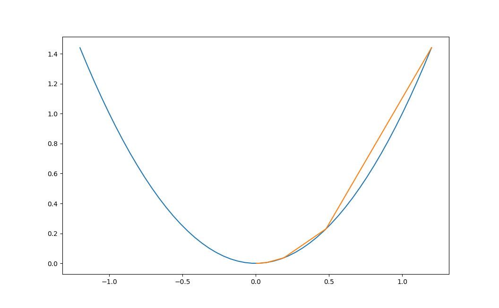

```
x=0.480000, y=0.230400
x=0.192000, y=0.036864
x=0.076800, y=0.005898
x=0.030720, y=0.000944
```

#### 双变量的梯度下降

根据公式(1)，迭代过程是的计算公式：
$$(x_{n+1},y_{n+1}) = (x_n,y_n) - \eta \cdot \nabla J(x,y)$$
$$ = (x_n,y_n) - \eta \cdot (2x,2 \cdot \sin y \cdot \cos y) \tag{1}$$

根据公式(1)，假设终止条件为$J(x,y)<1e-2$，迭代过程：

||x|y|J(x,y)|
|---|---|---|---|
|1|3|1|9.708073|
|2|2.4|0.909070|6.382415|
|3|1.92|0.812114|4.213103|
|...|...|...|...|
|15|0.105553|0.063481|0.015166|
|16|0.084442|0.050819|0.009711|

迭代16次后，J(x,y)的值为0.009711，满足小于1e-2的条件，停止迭代。

上面的过程如下图所示，由于是双变量，所以需要用三维图来解释。请注意看那条隐隐的黑色线，表示梯度下降的过程，从红色的高地一直沿着坡度向下走，直到蓝色的洼地。

#### 代码运行结果

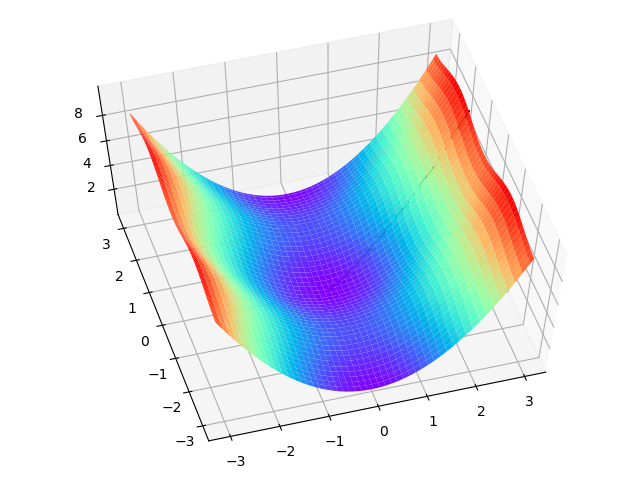

当学习率=0.8时，会有这种左右跳跃的情况发生，这不利于神经网络的训练。

#### 4、学习率η的选择

在公式表达时，学习率被表示为$\eta$。在代码里，我们把学习率定义为`learning_rate`，或者`eta`。针对上面的例子，试验不同的学习率对迭代情况的影响

当学习率=1.0时，学习率太大，迭代的情况很糟糕，在一条水平线上跳来跳去，永远也不能下降。

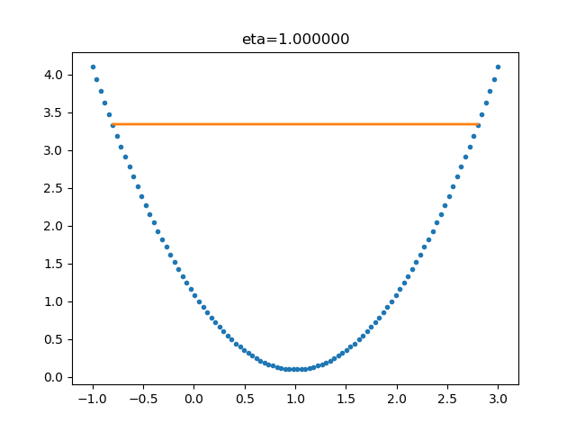

当学习率=0.8时，会有这种左右跳跃的情况发生，这不利于神经网络的训练。


当学习率=0.6时，也会有跳跃，幅度偏小。

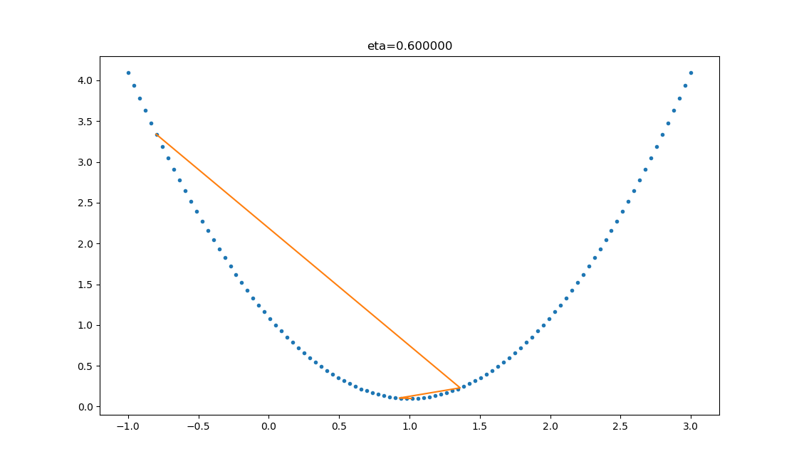

当学习率=0.4时，损失值会从单侧下降，4步以后基本接近了理想值。


当学习率=0.2时，损失值会从单侧下降，但下降速度较慢，8步左右接近极值。

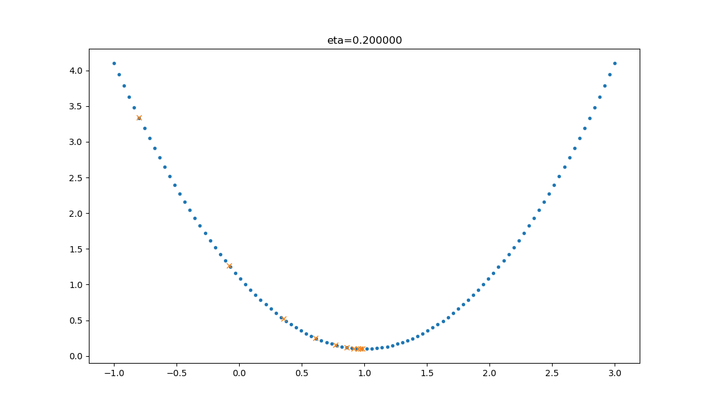

当学习率=0.1时，损失值会从单侧下降，但下降速度非常慢，10步了还没有到达理想状态。


### 损失函数

### 损失函数概念

在各种材料中经常看到的中英文词汇有：误差，偏差，Error，Cost，Loss，损失，代价......意思都差不多，在本系列文章中，使用损失函数和Loss Function这两个词汇，具体的损失函数符号用J()来表示，误差值用loss表示。

**损失**就是所有样本的**误差**的总和，亦即：
$$损失 = \sum^m_{i=1}误差_i$$
$$J = \sum_{i=1}^m loss$$

#### 损失函数的作用

损失函数的作用，就是计算神经网络每次迭代的前向计算结果与真实值的差距，从而指导下一步的训练向正确的方向进行。

#### 损失函数的具体步骤

1. 用随机值初始化前向计算公式的参数；
2. 代入样本，计算输出的预测值；
3. 用损失函数计算预测值和标签值（真实值）的误差；
4. 根据损失函数的导数，沿梯度最小方向将误差回传，修正前向计算公式中的各个权重值；
5. 进入第2步重复, 直到损失函数值达到一个满意的值就停止迭代。

### 2、机器学习常用损失函数

符号规则：a是预测值，y是样本标签值，J是损失函数值。

- Gold Standard Loss，又称0-1误差

$$
loss=\begin{cases} 0 & a=y \\ 1 & a \ne y \end{cases}
$$

- 绝对值损失函数

$$
loss = |y-a|
$$

- Hinge Loss，铰链/折页损失函数或最大边界损失函数，主要用于SVM（支持向量机）中

$$
loss=max(0,1-y \cdot a), y=\pm 1
$$

- Log Loss，对数损失函数，又叫交叉熵损失函数(cross entropy error)

$$
loss = -\frac{1}{m} \sum_i^m y_i log(a_i) + (1-y_i)log(1-a_i),  y_i \in \{0,1\}
$$

- Squared Loss，均方差损失函数


$$
loss=\frac{1}{2m} \sum_i^m (a_i-y_i)^2
$$

- Exponential Loss，指数损失函数


$$
loss = \frac{1}{m}\sum_i^m e^{-(y_i \cdot a_i)}
$$

#### 损失函数图像理解

##### 用二维函数图像理解单变量对损失函数的影响


上图中，纵坐标是损失函数值，横坐标是变量。不断地改变变量的值，会造成损失函数值的上升或下降。而梯度下降算法会让我们沿着损失函数值下降的方向前进。

1. 假设我们的初始位置在A点，X=x0，Loss值（纵坐标）较大，回传给网络做训练
2. 经过一次迭代后，我们移动到了B点，X=x1，Loss值也相应减小，再次回传重新训练
3. 以此节奏不断向损失函数的最低点靠近，经历了x2 x3 x4 x5
4. 直到损失值达到可接受的程度，就停止训练

#### 用等高线图理解双变量对损失函数影响

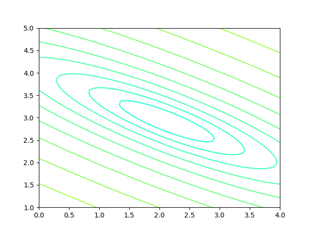

上图中，横坐标是一个变量w，纵坐标是另一个变量b。两个变量的组合形成的损失函数值，在图中对应处于等高线上的唯一的一个坐标点。所有的不同的值的组合会形成一个损失函数值的矩阵，我们把矩阵中具有相同（相近）损失函数值的点连接起来，可以形成一个不规则椭圆，其圆心位置，是损失值为0的位置，也是我们要逼近的目标。

这个椭圆如同平面地图的等高线，来表示的一个洼地，中心位置比边缘位置要低，通过对损失函数的计算，对损失函数的求导，会带领我们沿着等高线形成的梯子一步步下降，无限逼近中心点。

###  神经网络中常用的损失函数

- 均方差函数，主要用于回归

- 交叉熵函数，主要用于分类

二者都是非负函数，极值在底部，用梯度下降法可以求解。

### 均方差函数

函数就是最直观的一个损失函数了，计算预测值和真实值之间的欧式距离。预测值和真实值越接近，两者的均方差就越小。

均方差函数常用于线性回归(linear regression)，即函数拟合(function fitting)。

#### 公式

$$
loss = {1 \over 2}(z-y)^2 \tag{单样本}
$$

$$
J=\frac{1}{2m} \sum_{i=1}^m (z_i-y_i)^2 \tag{多样本}
$$
#### 工作原理

要想得到预测值a与真实值y的差距，最朴素的想法就是用$Error=a_i-y_i$。

对于单个样本来说，这样做没问题，但是多个样本累计时，$a_i-y_i$有可能有正有负，误差求和时就会导致相互抵消，从而失去价值。所以有了绝对值差的想法，即$Error=|a_i-y_i|$。

假设有三个样本的标签值是$y=[1,1,1]$：

|样本标签值|样本预测值|绝对值损失函数|均方差损失函数|
|------|------|------|------|
|$[1,1,1]$|$[1,2,3]$|$(1-1)+(2-1)+(3-1)=3$|$(1-1)^2+(2-1)^2+(3-1)^2=5$|
|$[1,1,1]$|$[1,3,3]$|$(1-1)+(3-1)+(3-1)=4$|$(1-1)^2+(3-1)^2+(3-1)^2=8$|
|||4/3=1.33|8/5=1.6|

可以看到5比3已经大了很多，8比4大了一倍，而8比5也放大了某个样本的局部损失对全局带来的影响。

#### 损失函数的可视化

##### 损失函数值的3D示意图

横坐标为w，纵坐标为b，针对每一个w和一个b的组合计算出一个损失函数值，用三维图的高度来表示这个损失函数值。下图中的底部并非一个平面，而是一个有些下凹的曲面，只不过曲率较小.

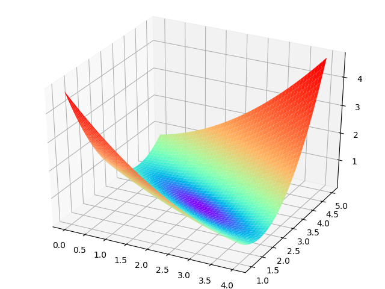

##### 损失函数值的2D示意图

在平面地图中，我们经常会看到用等高线的方式来表示海拔高度值，下图就是上图在平面上的投影，即损失函数值的等高线图。


#### 运行代码及结果

``` Python
    s = 200
    W = np.linspace(w-2,w+2,s)
    B = np.linspace(b-2,b+2,s)
    LOSS = np.zeros((s,s))
    for i in range(len(W)):
        for j in range(len(B)):
            z = W[i] * x + B[j]
            loss = CostFunction(x,y,z,m)
            LOSS[i,j] = round(loss, 2)
```
结果：


### 交叉熵损失函数

交叉熵（Cross Entropy）是Shannon信息论中一个重要概念，主要用于度量两个概率分布间的差异性信息。在信息论中，交叉熵是表示两个概率分布p,q的差异，其中p表示真实分布，q表示非真实分布，那么H(p,q)就称为交叉熵：

$$H(p,q)=\sum_i p_i \cdot log {1 \over q_i} = - \sum_i p_i \log q_i$$

交叉熵可在神经网络中作为损失函数，p表示真实标记的分布，q则为训练后的模型的预测标记分布，交叉熵损失函数可以衡量p与q的相似性。

**交叉熵函数常用于逻辑回归(logistic regression)，也就是分类(classification)。**

### 二分类问题交叉熵

当y=1时，即标签值是1，是个正例：

$$loss = -log(a)$$

横坐标是预测输出，纵坐标是损失函数值。y=1意味着当前样本标签值是1，当预测输出越接近1时，Loss值越小，训练结果越准确。当预测输出越接近0时，Loss值越大，训练结果越糟糕。

当y=0时，即标签值是0，是个反例：
$$loss = -\log (1-a)$$

此时，损失值与预测值的关系是：


我们改变一下上面的例子，假设出勤率高的同学都学会了课程，我们想建立一个预测器，对于一个特定的学员，根据TA的出勤率来预测：

|出勤率|高|低|
|---|---|---|
|学会了课程的真实值统计|1|0|
|根据学员的高出勤率的预测|||
|预测1|0.6|0.4|
|预测2|0.7|0.3|

那么这个预测与真实统计之间的交叉熵损失函数值是：

$$loss_1 = -(1 \times \log 0.6 + (1-1) \times \log (1-0.6)) = 0.51$$

$$loss_2 = -(1 \times \log 0.7 + (1-1) \times \log (1-0.7)) = 0.36$$

由于0.7是相对准确的值，所以loss2要比loss1小，反向传播的力度也会小。

#### 运行代码及结果

``` Python
import numpy as np
import matplotlib.pyplot as plt

def target_function2(a,y):
    p1 = y * np.log(a)
    p2 = (1-y) * np.log(1-a)
    y = -p1 - p2
    return y

if __name__ == '__main__':
    err = 1e-2  # avoid invalid math caculation
    a = np.linspace(0+err,1-err)
    y = 0
    z1 = target_function2(a,y)
    y = 1
    z2 = target_function2(a,y)
    p1, = plt.plot(a,z1)
    p2, = plt.plot(a,z2)
    plt.grid()
    plt.legend([p1,p2],["y=0","y=1"])
    plt.xlabel("a")
    plt.ylabel("Loss")
    plt.show()
```

结果：


#### 多分类问题交叉熵

最后输出层使用Softmax激活函数，并且配合One-Hot编码使用。

|等级|初级|中级|高级|
|---|---|---|---|
|出勤率很低|1|0|0|
|出勤率中等|0|1|0|
|出勤率很高|0|0|1|
|对于一个出勤率很高的同学的预测||||
|预测1|0.1|0.6|0.3|
|预测2|0.1|0.3|0.6|


我们想建立一个预测器，预测一个出勤率很高的学员的学习等级，很显然，根据标签值，应该属于$[0,0,1]$。

假设开始时不太准确，一个学员的出勤率很高，但预测出的值为：$[0.1, 0.6, 0.3]$，这样得到的交叉熵是：

$$loss_1 = -(0 \times \log 0.1 + 0 \times \log 0.6 + 1 \times \log 0.3) = 1.2$$

如果预测出的值为：$[0.1, 0.3, 0.6]$，标签为：$[0, 0, 1]$，这样得到的交叉熵是：

$$loss_2 = -(0 \times \log 0.1 + 0 \times \log 0.3 + 1 \times \log 0.6) = 0.51$$

可以看到，0.51比1.2的损失值小很多，这说明预测值越接近真实标签值(0.6 vs 0.3)，交叉熵损失函数值越小，反向传播的力度越小。


## 总结及心得体会：

在Step1中，我学习到了

- 什么是人工智能？
- 人工智能是基于什么上的？
- 范式的演化分哪四步？
- 神经网络的基本工作原理，是通过什么公式？
- 这个公式的各个变量分别代表什么？
- 神经网络的训练过程是什么？
- 神经网络的主要功能是什么？ 
- 激活函数的作用是什么？ 
- 反向传播与梯度下降的基本工作原理是什么？ 
- 在线性反向传播中，怎么分别从反向传播求解w,求解b，同时求解w和b的变化求解？ 
- 在非线性反向传播，相对于线性反向传播的优势在哪里？
- 梯度下降的数学公式是什么？各个符号的含义是什么？
- 梯度下降的两层含义是什么？ 
- 理解什么是单变量函数和双变量函数的梯度下降。 
- 在不同的学习率对梯度下降有什么影响？ 
- 损失函数的概念是什么？ 
- 损失函数的作用什么？ 
- 损失函数的具体步骤是什么？ 
- 损失函数在二维图像和等高线图的理解。 
- 神经网络中常用的损失函数分为哪两种？ 
- 它们分别主要用于哪里？

在本次学习中，

1. 更加熟练的掌握了markdown的阅读与书写规则
2. 逐渐理解掌握了基于Python代码的神经网络代码
3. 掌握了通过mingw64从GitHub网站上拷贝到本地 代码：git clone + 网址 , #更新本地 git pull 
4. 掌握了GitHub Desktop APP的应用方法，使得自己的作业可以通过本地传送到自己的网址上，再自己GitHub的作业上传到老师的账户上