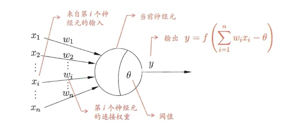
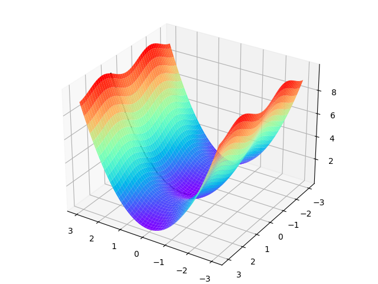

201809058  Wang Yulong

**1.人工智能** 

=======
**1.1 定义：** 如果程序解某种任务T的效果P随着经验E的增加而得到了提高，
那么这个程序就能从经验E中学到了关于任务T的知识，并让效果P得到提高。

1.2 **机器学习的具体过程:**
-------
·选择一个模型结构（例如逻辑回归、决策树等），构建上文中的程序

·将训练数据（包含输入和输出）输入模型中，不断学习，得到经验E

·通过不断执行任务T并衡量效果P，让P不断提高，直到达到一个满意的值

1.3 BP神经元模型
----------------
&emsp;&emsp;在生物神经网络中，每个神经元与其他神经元相连，当它兴奋时，就会像相邻的神经元发送化学物质，从而改变这些神经元内的电位；如果某神经元的电位超过了一个阈值，那么它就会被激活（兴奋），向其他神经元发送化学物质。把许多这样的神经元按照一定的层次结构连接起来，我们就构建了一个神经网络。

**BP神经元结构图**

---
#  
**2.神经元的基本训练**

**基本思想：**首先人为设定一个初始值a【初始化】=>观察初始值a和训练集中y值的偏差【找偏差】=>修改方案，力求机器的值和真实值y的偏差越来越小，直至在误差允许范围内【机器学习】

## 2.1概念梳理

### 反向传播
定义：将输出值反馈到输入.

### 梯度下降
定义：根据损失函数的值，调整机器学习的策略，从而接近真实值.

### 损失函数
定义：机器算出的值与真实值之间的误差.

假设有一个黑盒子如图2-1

我们只能看到输入和输出的数值，看不到里面的样子，当输入1时，输出2.334，然后黑盒子有个信息显示：我需要输出值是4。然后我们试了试输入2，结果输出5.332，一下子比4大了很多。那么我们第一次的损失值是 $2.334-4=-1.666$，而二次的损失值是 $5.332-4=1.332$。

这里，我们的损失函数就是一个简单的减法，用实际值减去目标值，但是它可以传递两个信息：

 ▲ 方向，是大了还是小了；

 ▲ 差值，是0.1还是1.1。这样就给了我们下一次猜的依据。

- 目的：猜到一个输入值，使得黑盒子的输出是4；
- 初始化：输入1；
- 前向计算：黑盒子内部的数学逻辑；
- 损失函数：在输出端，用输出值减4；
- 反向传播：告诉猜数的人差值，包括正负号和值；
- 梯度下降：在输入端，根据正负号和值，确定下一次的猜测值。

## 2.2 代码分析
~~~Python
线性反向传播---Python
import numpy as np

def target_function(w,b):
    x = 2*w+3*b
    y=2*b+1
    z=x*y
    return x,y,z

def single_variable(w,b,t):
    print("\nsingle variable: b ----- ")
    error = 1e-5
    while(True):
        x,y,z = target_function(w,b)
        delta_z = z - t
        print("w=%f,b=%f,z=%f,delta_z=%f"%(w,b,z,delta_z))
        if abs(delta_z) < error:
            break
        delta_b = delta_z /63
        print("delta_b=%f"%delta_b)
        b = b - delta_b

    print("done!")
    print("final b=%f"%b)

    if __name__ == '__main__':
    w = 3
    b = 4
    t = 150
    single_variable(w,b,t)
~~~
~~~Python
测试结果：

single variable: b ----- 
w=3.000000,b=4.000000,z=162.000000,delta_z=12.000000
delta_b=0.190476
w=3.000000,b=3.809524,z=150.217687,delta_z=0.217687 
delta_b=0.003455
w=3.000000,b=3.806068,z=150.007970,delta_z=0.007970 
delta_b=0.000127
w=3.000000,b=3.805942,z=150.000294,delta_z=0.000294
delta_b=0.000005
w=3.000000,b=3.805937,z=150.000011,delta_z=0.000011
delta_b=0.000000
w=3.000000,b=3.805937,z=150.000000,delta_z=0.000000
done!
final b=3.805937
~~~
$$此为线性反向传播的代码实例，w=3,b=4,t=150,目的是将z值变为目标值t，方法即为在不改变w的前提下，通过改变b值从$$
$$而达到改变w值的目标,在这个过程中就需要使用偏导数$$
$$   x = 2*w+3*b $$
$$   y=2*b+1   $$  
$$   z=x*y     $$
$$代入计算得：z=162$$
$$\frac{\partial{Z}}{\partial{b}} =\frac{\partial{Z}}{\partial{x}}·\frac{\partial{x}}{\partial{b}}+\frac{\partial{Z}}{\partial{y}}·\frac{\partial{y}}{\partial{b}}$$
$$ \frac{\partial{Z}}{\partial{b}} =y·3+x·2=9·3+18·2=63$$
$$\frac{\partial{Z}}{\partial{b}} =\frac{▲Z}{▲b}=63$$
$$▲Z=162-150=12$$
$$\frac{▲Z}{▲b}=63=\frac{12}{▲b}$$
$$▲b=\frac{12}{63}=0.190476  \tag{误差函数}$$
正向计算：
$$第一次迭代：b_1=b-▲b=3.809524  \tag{梯度下降}$$
$$x_1=2w+3b_1=2×3+3×3.809524=17.428572$$
$$y_1 = 2 b_1 + 1 = 2 × 3.809524 + 1 = 8.619048$$
$$z_1 = x_1 × y_1 = 17.43 × 8.62 = 150.217687$$
$$▲b_1=\frac{150.217687-150}{63}=0.003455$$
$$第二次迭代：b_2=b_1-▲b_1=3.806068$$
$$x_2=2w+3b_2=2×3+3×3.806068=17.418204$$
$$y_2 = 2 b_2 + 1 = 2 × 3.806068 + 1 = 8.612136$$
$$z_2=x_2 × y_2=150.0079$$
$$.................$$
$$共经过5次迭代计算即可达到误差允许范围$$

#### 梯度下降
$$数学公式：θ_{n+1}=θ_n+η▼J(θ_n)$$
$$ 学习率η,偏导数▼J(θ_n)$$
$$假设一个单变量的函数J(θ)=θ^2$$
$$函数的微分J'(θ)=2θ$$
$$设置起点θ_0=1.2，学习率η=0.3$$
$$θ_1=θ_0-2ηθ_0=0.48$$
$$θ_2=θ_1-2ηθ_1=0.192$$
$$θ_3=θ_2-2ηθ_2=0.0768$$

橙色折线则代表梯度方向的下降过程

如图为双变量函数的梯度下降过程

&emsp;&emsp;下降的过程中，如线条所示，沿坡度的方向，曲线从红色高地下降至蓝色洼地中,可以看出坡度方向是函数变化最快的方向.
表2-5 不同学习率对迭代情况的影响

|学习率|迭代路线图|说明|
|---|---|---|
|1.0||学习率太大，迭代的情况很糟糕，在一条水平线上跳来跳去，永远也不能下降。|
|0.8||学习率大，会有这种左右跳跃的情况发生，这不利于神经网络的训练。|
|0.4||学习率合适，损失值会从单侧下降，四步以后基本接近了理想值。|
|0.1||学习率较小，损失值会从单侧下降，但下降速度非常慢，十步了还没有到达理想状态。|

---
#  
**3.损失函数概论**

$$损失--所有样本的误差总和$$
$$J = \sum_{i=1}^mloss_i$$

## 3.1 损失函数使用步骤
- 用随机值初始化前向计算公式的参数
- 代入样本，计算输出的预测值
- 用损失函数计算预测值和标签值（真实值）的误差
- 根据损失函数的导数，沿梯度最小方向将误差回传，修正前向计算公式中的各个权重值
- 重复步骤2，直到损失函数值达到一个满意的值就停止迭代

## 3.2 机器学习常用的损失函数
符号规则：$a$ 是预测值，$y$ 是样本标签值，$loss$ 是损失函数值。

- Gold Standard Loss，又称0-1误差
$$
loss=\begin{cases}
0 & a=y \\\\
1 & a \ne y 
\end{cases}
$$

- 绝对值损失函数

$$
loss = |y-a|
$$

- Hinge Loss，铰链/折页损失函数或最大边界损失函数，主要用于SVM（支持向量机）中
$$
loss = -[y \cdot \ln (a) + (1-y) \cdot \ln (1-a)]  $$
$$ \qquad y \in{ (0,1)}$$ 

- Squared Loss，均方差损失函数
$$
loss=(a-y)^2
$$

- Exponential Loss，指数损失函数
$$
loss = e^{-(y \cdot a)}
$$

神经网络中常用的损失函数

- 均方差函数，主要用于回归

- 交叉熵函数，主要用于分类

## 3.3 均方差函数

- 为了得到预测值 $a$ 与真实值 $y$ 的差距，最朴素的想法就是用 $Error=a_i-y_i$，但如果遇到大量数据，误差有正负之分，累加之后可能相互抵消，误差的累加就失去了价值

图3-4中，前三张显示了一个逐渐找到最佳拟合直线的过程。

- 第一张，用均方差函数计算得到 $Loss=0.53$；
- 第二张，直线向上平移一些，误差计算 $Loss=0.16$，比图一的误差小很多；
- 第三张，又向上平移了一些，误差计算 $Loss=0.048$，此后还可以继续尝试平移（改变 $b$ 值）或者变换角度（改变 $w$ 值），得到更小的损失函数值；
- 第四张，偏离了最佳位置，误差值 $Loss=0.18$，这种情况，算法会让尝试方向反向向下。

图3-4 损失函数值与直线位置的关系

## 3.4 交叉熵函数

交叉熵（Cross Entropy）是Shannon信息论中一个重要概念，主要用于度量两个概率分布间的差异性信息。在信息论中，交叉熵是表示两个概率分布 $p,q$ 的差异，其中 $p$ 表示真实分布，$q$ 表示预测分布，那么 $H(p,q)$ 就称为交叉熵：

$$H(p,q)=\sum_i p_i \cdot \ln {1 \over q_i} = - \sum_i p_i \ln q_i \tag{1}$$

假设学习某门课程有三种可能的情况发生，如表3-2所示。

表3-2 三种事件的概论和信息量

|事件编号|事件|概率 $p$|信息量 $I$|
|---|---|---|---|
|$x_1$|优秀|$p=0.7$|$I=-\ln(0.7)=0.36$|
|$x_2$|及格|$p=0.2$|$I=-\ln(0.2)=1.61$|
|$x_3$|不及格|$p=0.1$|$I=-\ln(0.1)=2.30$|

$x_j$：表示一个事件

$p(x_j)$：表示 $x_j$ 发生的概率

$I(x_j)$：信息量，$x_j$ 越不可能发生时，它一旦发生后的信息量就越大
$$I(x_j) = -\ln (p(x_j)) \tag{2}$$

从上表可知，信息量$I(x_j)$和概率$p$是成反比的，即$I(x_j)$的值越大，$p$的值越小，事件发生的概率越小。

---
#  
**4.学习总结及心得**

