# Step4、5笔记总结

## 学号：201809009  姓名：王征宇

## 本文将会通过以下四个要求书写笔记

时间：2020年10月9日

要求：

1. 必须采用markdown格式，图文并茂，并且务必在github网站上能正确且完整的显示；

2. 详细描述ai-edu中Step4、Step5的学习过程；重要公式需要亲手推导；

3. 必须包含对代码的理解，以及相应分析和测试过程；

4. 必须包含学习总结和心得体会。

### 一、第四步  非线性回归

#### 1、激活函数

#### (1)激活函数的基本作用

看神经网络中的一个神经元，为了简化，假设该神经元接受三个输入，分别为$x_1, x_2, x_3$，那么：

$$z=x_1 w_1 + x_2 w_2 + x_3 w_3 +b \tag{1}$$
$$a = \sigma(z) \tag{2}$$


激活函数也就是$a=\sigma(z)$这一步了，他有什么作用呢？

1. 给神经网络增加非线性因素，这个问题在第1章《神经网络基本工作原理》中已经讲过了；
2. 把公式1的计算结果压缩到[0,1]之间，便于后面的计算。

#### (2)激活函数的基本性质：

+ 非线性：线性的激活函数和没有激活函数一样
+ 可导性：做误差反向传播和梯度下降，必须要保证激活函数的可导性
+ 单调性：单一的输入会得到单一的输出，较大值的输入得到较大值的输出

在物理试验中使用的继电器，是最初的激活函数的原型：当输入电流大于一个阈值时，会产生足够的磁场，从而打开下一级电源通道，如下图所示：

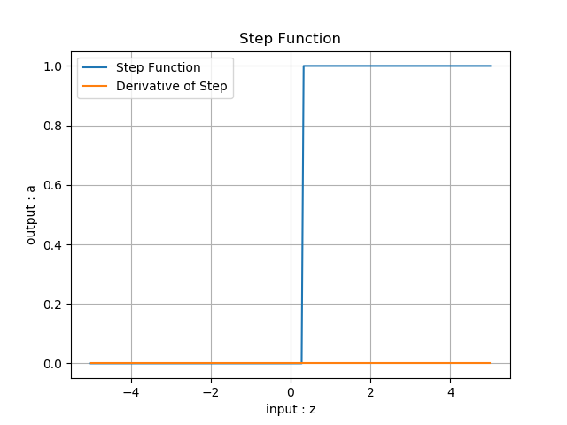

用到神经网络中的概念，用‘1’来代表一个神经元被激活，‘0’代表一个神经元未被激活。

#### 2、挤压型激活函数 Squashing Function

#### （1）对数几率函数 Sigmoid Function

对率函数，在用于激活函数时常常被称为Sigmoid函数，因为它是最常用的Sigmoid函数。

#### 公式

$$a(z) = \frac{1}{1 + e^{-z}}$$

#### 导数

$$a^{'}(z) = a(z) \odot (1 - a(z))$$

利用公式33，令：$u=1，v=1+e^{-z}$ 则：

$$
a' = \frac{u'v-v'u}{v^2}=\frac{0-(1+e^{-z})'}{(1+e^{-z})^2}
$$
$$
=\frac{e^{-z}}{(1+e^{-z})^2}
=\frac{1+e^{-z}-1}{(1+e^{-z})^2}
$$
$$
=\frac{1}{1+e^{-z}}-(\frac{1}{1+e^{-z}})^2
$$
$$
=a-a^2=a(1-a)
$$

#### 值域

输入值域：$[-\infty, \infty]$

输出值域：$[0,1]$

#### 函数图像

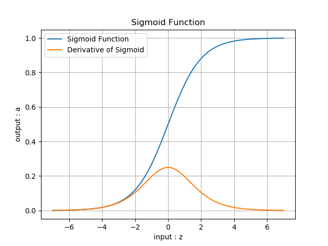

#### （2）Tanh函数

TanHyperbolic，双曲正切函数。

#### 公式  

$$a(z) = \frac{e^{z} - e^{-z}}{e^{z} + e^{-z}} = \frac{2}{1 + e^{-2z}} - 1$$

$$a(z) = 2 \cdot Sigmoid(2z) - 1$$

#### 导数公式

$$a'(z) = (1 + a(z)) \odot (1 - a(z))$$

利用基本导数公式23，令：$u={e^{z}-e^{-z}}，v=e^{z}+e^{-z}$ 则

$$
a'=\frac{u'v-v'u}{v^2} \tag{71}
$$
$$
=\frac{(e^{z}-e^{-z})'(e^{z}+e^{-z})-(e^{z}+e^{-z})'(e^{z}-e^{-z})}{(e^{z}+e^{-z})^2}
$$
$$
=\frac{(e^{z}+e^{-z})(e^{z}+e^{-z})-(e^{z}-e^{-z})(e^{z}-e^{-z})}{(e^{z}+e^{-z})^2}
$$
$$
=\frac{(e^{z}+e^{-z})^2-(e^{z}-e^{-z})^2}{(e^{z}+e^{-z})^2}
$$
$$
=1-(\frac{(e^{z}-e^{-z}}{e^{z}+e^{-z}})^2=1-a^2
$$

#### 值域

输入值域：$[-\infty, \infty]$

输出值域：$[-1,1]$

#### 函数图像


#### 3、 半线性激活函数

#### （1）ReLU函数 

Rectified Linear Unit，修正线性单元，线性整流函数，斜坡函数。

#### 公式

$$a(z) = max(0,z) = \begin{Bmatrix} 
  z & (z \geq 0) \\ 
  0 & (z < 0) 
\end{Bmatrix}$$

#### 导数

$$a'(z) = \begin{cases} 1 & z \geq 0 \\ 0 & z < 0 \end{cases}$$

#### 值域

输入值域：$[-\infty, \infty]$

输出值域：$[0,\infty]$

导数值域：$[0,1]$

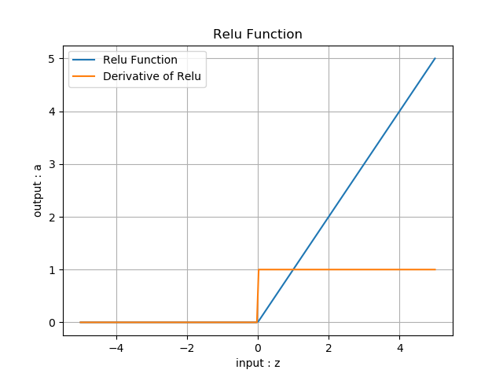

#### （2）Leaky ReLU函数

PReLU，带泄露的线性整流函数。

#### 公式

$$a(z) = \begin{cases} z & z \geq 0 \\ \alpha * z & z < 0 \end{cases}$$

#### 导数

$$a'(z) = \begin{cases} z & 1 \geq 0 \\ \alpha & z < 0 \end{cases}$$

#### 值域

输入值域：$[-\infty, \infty]$

输出值域：$[-\infty,\infty]$

导数值域：$[0,1]$

#### 函数图像


## 二、 单入单出的双层神经网络

### 1、用多项式回归法拟合正弦曲线

#### （1）用二次多项式拟合

鉴于以上的认知，我们要考虑使用几次的多项式来拟合正弦曲线。在没有什么经验的情况下，可以先试一下二次多项式，即：

$$z = x w_1 + x^2 w_2 + b \tag{5}$$

#### 数据增强

在ch08.train.npz中，读出来的XTrain数组，只包含1列x的原始值，根据公式5，我们需要再增加一列x的平方值，所以代码如下：

```Python
import numpy as np
import matplotlib.pyplot as plt

from HelperClass.NeuralNet import *
from HelperClass.SimpleDataReader import *
from HelperClass.HyperParameters import *

file_name = "../../data/ch08.train.npz"

class DataReaderEx(SimpleDataReader):
    def Add(self):
        X = self.XTrain[:,]**2
        self.XTrain = np.hstack((self.XTrain, X))
```

从SimpleDataReader类中派生出子类DataReaderEx，然后添加Add()方法，先计算XTrain第一列的平方值放入矩阵X中，然后再把X合并到XTrain右侧，这样XTrain就变成了两列，第一列是x的原始值，第二列是x的平方值。

#### 主程序

在主程序中，先加载数据，做数据增强，然后建立一个net，参数num_input=2，对应着XTrain中的两列数据，相当于两个特征值，

```Python
if __name__ == '__main__':
    dataReader = DataReaderEx(file_name)
    dataReader.ReadData()
    dataReader.Add()
    print(dataReader.XTrain.shape)

    # net
    num_input = 2
    num_output = 1
    params = HyperParameters(num_input, num_output, eta=0.2, max_epoch=10000, batch_size=10, eps=0.005, net_type=NetType.Fitting)
    net = NeuralNet(params)
    net.train(dataReader, checkpoint=10)
    ShowResult(net, dataReader, params.toString())
```

#### 运行结果

|损失函数值|拟合结果|
|---|---|
||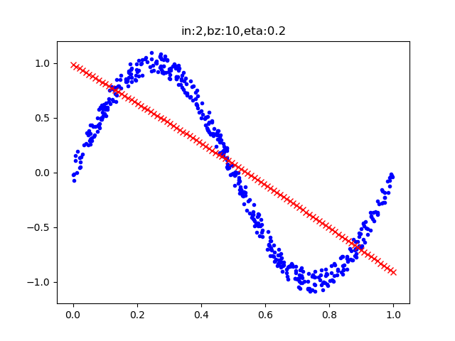|

#### （2）用三次多项式拟合

三次多项式的公式：

$$z = x w_1 + x^2 w_2 + x^3 w_3 + b \tag{6}$$

在二次多项式的基础上，把训练数据的再增加一列x的三次方，作为一个新的特征。以下为数据增强代码：

```Python
class DataReaderEx(SimpleDataReader):
    def Add(self):
        X = self.XTrain[:,]**2
        self.XTrain = np.hstack((self.XTrain, X))
        X = self.XTrain[:,0:1]**3
        self.XTrain = np.hstack((self.XTrain, X))
```
同时修改主过程参数中的num_input值：

```Python
    num_input = 3
```

再次运行：

|损失函数值|拟合结果|
|---|---|
|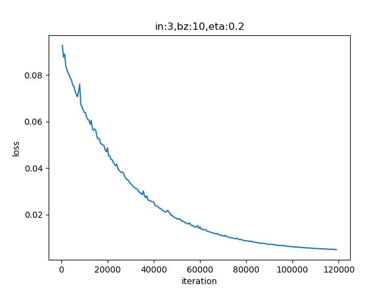|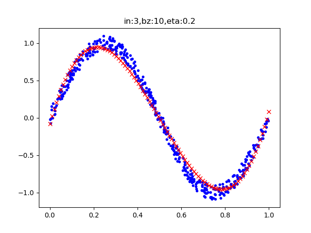|

#### （3）用四次多项式拟合

第一步依然是增加x的4次方作为特征值：

```Python
        X = self.XTrain[:,0:1]**4
        self.XTrain = np.hstack((self.XTrain, X))
```

第二步设置超参num_input=4，然后训练，得到表9-6的结果。

表9-6 四次多项式训练过程与结果

|损失函数值|拟合结果|
|---|---|
|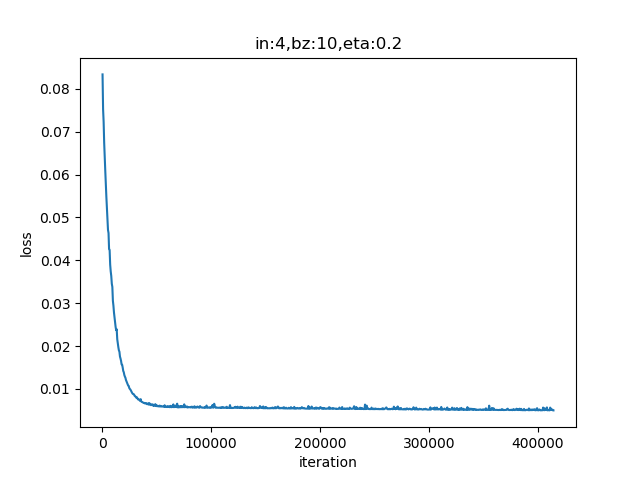|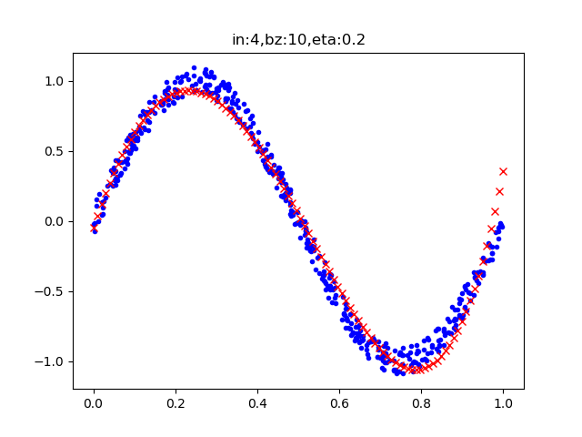|

表9-1 不同项数的多项式拟合结果比较

|多项式次数|迭代数|损失函数值|
|:---:|---:|---:|
|2|10000|0.095|
|3|2380|0.005|
|4|8290|0.005|

从表9-1的结果比较中可以得到以下结论：

1. 二次多项式的损失值在下降了一定程度后，一直处于平缓期，不再下降，说明网络能力到了一定的限制，直到10000次迭代也没有达到目的；
2. 损失值达到0.005时，四项式迭代了8290次，比三次多项式的2380次要多很多，说明四次多项式多出的一个特征值，没有给我们带来什么好处，反而是增加了网络训练的复杂度。

###  用多项式回归法拟合复合函数曲线

我们尝试着用多项式解决问题二，拟合复杂的函数曲线。


图9-2 样本数据可视化

再把图9-2所示的这条“眼镜蛇形”曲线拿出来观察一下，不但有正弦式的波浪，还有线性的爬升，转折处也不是很平滑，所以难度很大。从正弦曲线的拟合经验来看，三次多项式以下肯定无法解决，所以我们可以从四次多项式开始试验。

### 用四次多项式拟合

代码与正弦函数拟合方法区别不大，不再赘述，我们本次主要说明解决问题的思路。

超参的设置情况：

```Python
    num_input = 4
    num_output = 1    
    params = HyperParameters(num_input, num_output, eta=0.2, max_epoch=100000, batch_size=10, eps=1e-3, net_type=NetType.Fitting)
```
损失函数值到了一定程度后就不再下降了，说明网络能力有限。再看下面打印输出的具体数值，在0.005左右是一个极限。

### 用八次多项式拟合

再跳过7次多项式，直接使用8次多项式。先把`max_epoch`设置为50000试验一下。

表9-3 八项式5万次迭代的训练结果

|损失函数历史|曲线拟合结果|
|---|---|
|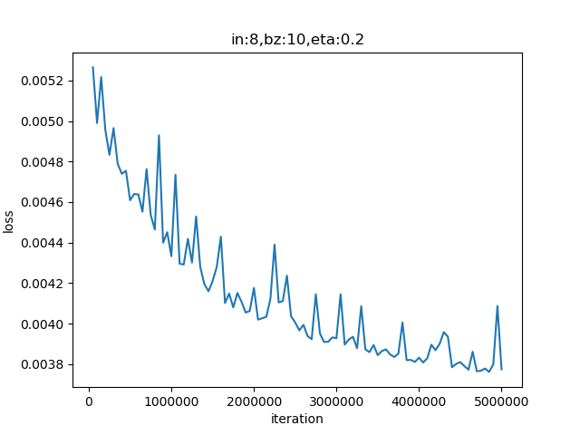|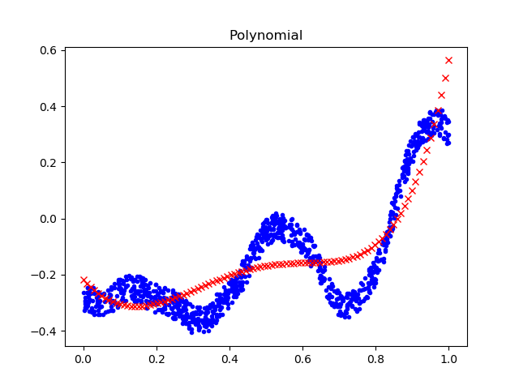|

表9-3中损失函数值下降的趋势非常可喜，似乎还没有遇到什么瓶颈，仍有下降的空间，并且拟合的效果也已经初步显现出来了。

再看下面的打印输出，损失函数值已经可以突破0.004的下限了。

```
......
49499 99 0.004086918553033752
49999 99 0.0037740488283595657
W= [[ -2.44771419]
 [  9.47854206]
 [ -3.75300184]
 [-14.39723202]
 [ -1.10074631]
 [ 15.09613263]
 [ 13.37017924]
 [-15.64867322]]
B= [[-0.16513259]]
```

根据以上情况，可以认为8次多项式很有可能得到比较理想的解，所以我们需要增加`max_epoch`数值，让网络得到充分的训练。好，设置`max_epoch=1000000`试一下！没错，是一百万次！开始运行后，大家就可以去做些别的事情，一两个小时之后再回来看结果。

表9-4 八项式100万次迭代的训练结果

|损失函数历史|曲线拟合结果|
|---|---|
|||

从表9-4的结果来看，损失函数值还有下降的空间和可能性，已经到了0.0016的水平（从后面的章节中可以知道，0.001的水平可以得到比较好的拟合效果），拟合效果也已经初步呈现出来了，所有转折的地方都可以复现，只是精度不够，相信更多的训练次数可以达到更好的效果。


```
......
998999 99 0.0015935143877633367
999999 99 0.0016124984420510522
W= [[  2.75832935]
 [-30.05663986]
 [ 99.68833781]
 [-85.95142109]
 [-71.42918867]
 [ 63.88516377]
 [104.44561608]
 [-82.7452897 ]]
B= [[-0.31611388]]
```

分析打印出的`W`权重值，x的原始特征值的权重值比后面的权重值小了一到两个数量级，这与归一化后x的高次幂的数值很小有关系。

至此，我们可以得出结论，多项式回归确实可以解决复杂曲线拟合问题，但是代价有些高，我们训练了一百万次，才得到初步满意的结果。

## 验证与测试

### 基本概念

#### 训练集

Training Set，用于模型训练的数据样本。

#### 验证集

Validation Set，或者叫做Dev Set，是模型训练过程中单独留出的样本集，它可以用于调整模型的超参数和用于对模型的能力进行初步评估。
  
在神经网络中，验证数据集用于：

- 寻找最优的网络深度
- 或者决定反向传播算法的停止点
- 或者在神经网络中选择隐藏层神经元的数量
- 在普通的机器学习中常用的交叉验证（Cross Validation）就是把训练数据集本身再细分成不同的验证数据集去训练模型。

#### 测试集

Test Set，用来评估最终模型的泛化能力。但不能作为调参、选择特征等算法相关的选择的依据。

三者之间的关系如图9-5所示。


### 交叉验证

#### 传统的机器学习

在传统的机器学习中，我们经常用交叉验证的方法，比如把数据分成10份，$V_1\sim V_{10}$，其中 $V_1 \sim V_9$ 用来训练，$V_{10}$ 用来验证。然后用 $V_2\sim V_{10}$ 做训练，$V_1$ 做验证……如此我们可以做10次训练和验证，大大增加了模型的可靠性。

这样的话，验证集也可以做训练，训练集数据也可以做验证，当样本很少时，这个方法很有用。

#### 神经网络/深度学习

一个BP神经网络，我们无法确定隐层的神经元数目，因为没有理论支持。此时可以按图9-6的示意图这样做。


图9-6 交叉训练的数据配置方式

1. 随机将训练数据分成K等份（通常建议 $K=10$），得到$D_0,D_1,D_9$；
2. 对于一个模型M，选择 $D_9$ 为验证集，其它为训练集，训练若干轮，用 $D_9$ 验证，得到误差 $E$。再训练，再用 $D_9$ 测试，如此N次。对N次的误差做平均，得到平均误差；
3. 换一个不同参数的模型的组合，比如神经元数量，或者网络层数，激活函数，重复2，但是这次用 $D_8$ 去得到平均误差；
4. 重复步骤2，一共验证10组组合；
5. 最后选择具有最小平均误差的模型结构，用所有的 $D_0 \sim D_9$ 再次训练，成为最终模型，不用再验证；
6. 用测试集测试。

### 留出法 Hold out

亦即从训练数据中保留出验证样本集，主要用于解决过拟合情况，这部分数据不用于训练。如果训练数据的准确度持续增长，但是验证数据的准确度保持不变或者反而下降，说明神经网络亦即过拟合了，此时需要停止训练，用测试集做最终测试。

所以，训练步骤的伪代码如下：

```
for each epoch
    shuffle
    for each iteraion
        获得当前小批量数据
        前向计算
        反向传播
        更新梯度
        if is checkpoint
            用当前小批量数据计算训练集的loss值和accuracy值并记录
            计算验证集的loss值和accuracy值并记录
            如果loss值不再下降，停止训练
            如果accuracy值满足要求，停止训练
        end if
    end for
end for
```

### 代码分析

从本章开始，我们将使用新的`DataReader`类来管理训练/测试数据，与前面的`SimpleDataReader`类相比，这个类有以下几个不同之处：

- 要求既有训练集，也有测试集
- 提供`GenerateValidationSet()`方法，可以从训练集中产生验证集

以上两个条件保证了我们在以后的训练中，可以使用本节中所描述的留出法，来监控整个训练过程。

关于三者的比例关系，在传统的机器学习中，三者可以是6:2:2。在深度学习中，一般要求样本数据量很大，所以可以给训练集更多的数据，比如8:1:1。

如果有些数据集已经给了你训练集和测试集，那就不关心其比例问题了，只需要从训练集中留出10%左右的验证集就可以了。

### 代码实现

定义DataReader类如下：

```Python
class DataReader(object):
    def __init__(self, train_file, test_file):
        self.train_file_name = train_file
        self.test_file_name = test_file
        self.num_train = 0        # num of training examples
        self.num_test = 0         # num of test examples
        self.num_validation = 0   # num of validation examples
        self.num_feature = 0      # num of features
        self.num_category = 0     # num of categories
        self.XTrain = None        # training feature set
        self.YTrain = None        # training label set
        self.XTest = None         # test feature set
        self.YTest = None         # test label set
        self.XTrainRaw = None     # training feature set before normalization
        self.YTrainRaw = None     # training label set before normalization
        self.XTestRaw = None      # test feature set before normalization
        self.YTestRaw = None      # test label set before normalization
        self.XVld = None          # validation feature set
        self.YVld = None          # validation lable set
```

### 代码理解

命名规则：

1. 以`num_`开头的表示一个整数，后面跟着数据集的各种属性的名称，如训练集（`num_train`）、测试集（`num_test`）、验证集（`num_validation`）、特征值数量（`num_feature`）、分类数量（`num_category`）；
2. `X`表示样本特征值数据，`Y`表示样本标签值数据；
3. `Raw`表示没有经过归一化的原始数据。


#### (3)双层神经网络实现非线性回归

#### ①定义神经网络结构

通过观察样本数据的范围，x是在[0,1]，y是[-0.5,0.5]，这样我们就不用做数据归一化了。这条线看起来像一条处于攻击状态的眼镜蛇！由于是拟合任务，所以标签值y是一系列的实际数值，并不是0/1这样的特殊标记。

根据万能近似定理的要求，我们定义一个两层的神经网络，输入层不算，一个隐藏层，含3个神经元，一个输出层。

为什么用3个神经元呢？因为输入层只有一个特征值，我们不需要在隐层放很多的神经元，先用3个神经元试验一下。如果不够的话再增加，神经元数量是由超参控制的。


#### 输入层

输入层就是一个标量x值。

$$X = (x)$$

#### 权重矩阵W1/B1

$$
W1=
\begin{pmatrix}
w^1_{11} & w^1_{12} & w^1_{13}
\end{pmatrix}
$$

$$
B1=
\begin{pmatrix}
b^1_{1} & b^1_{2} & b^1_{3} 
\end{pmatrix}
$$

#### 隐层

我们用3个神经元：

$$
Z1 = \begin{pmatrix}
    z^1_1 & z^1_2 & z^1_3
\end{pmatrix}
$$

$$
A1 = \begin{pmatrix}
    a^1_1 & a^1_2 & a^1_3
\end{pmatrix}
$$


#### 权重矩阵W2/B2

W2的尺寸是3x1，B2的尺寸是1x1。
$$
W2=
\begin{pmatrix}
w^2_{11} \\
w^2_{21} \\
w^2_{31}
\end{pmatrix}
$$

$$
B2=
\begin{pmatrix}
b^2_{1}
\end{pmatrix}
$$

#### 输出层

由于我们只想完成一个拟合任务，所以输出层只有一个神经元：

$$
Z2 = 
\begin{pmatrix}
    z^2_{1}
\end{pmatrix}
$$

#### ②代码实现

主要是神经网络NeuralNet2类的代码，其它的类都是辅助类。

#### 前向计算

```Python
class NeuralNet2(object):
    def forward(self, batch_x):
        # layer 1
        self.Z1 = np.dot(batch_x, self.wb1.W) + self.wb1.B
        self.A1 = Sigmoid().forward(self.Z1)
        # layer 2
        self.Z2 = np.dot(self.A1, self.wb2.W) + self.wb2.B
        if self.hp.net_type == NetType.BinaryClassifier:
            self.A2 = Logistic().forward(self.Z2)
        elif self.hp.net_type == NetType.MultipleClassifier:
            self.A2 = Softmax().forward(self.Z2)
        else:   # NetType.Fitting
            self.A2 = self.Z2
        #end if
        self.output = self.A2
```        

在Layer2中考虑了多种网络类型，在此我们暂时只关心NetType.Fitting类型。

#### 反向传播

```Python

class NeuralNet2(object):
    def backward(self, batch_x, batch_y, batch_a):
        # 批量下降，需要除以样本数量，否则会造成梯度爆炸
        m = batch_x.shape[0]
        # 第二层的梯度输入 
        dZ2 = self.A2 - batch_y
        # 第二层的权重和偏移 
        self.wb2.dW = np.dot(self.A1.T, dZ2)/m 
        # 公式7 对于多样本计算，需要在横轴上做sum，得到平均值
        self.wb2.dB = np.sum(dZ2, axis=0, keepdims=True)/m 
        # 第一层的梯度输入 
        d1 = np.dot(dZ2, self.wb2.W.T) 
        # 第一层的dZ 公式10
        dZ1,_ = Sigmoid().backward(None, self.A1, d1)
        # 第一层的权重和偏移 
        self.wb1.dW = np.dot(batch_x.T, dZ1)/m
        # 公式12 对于多样本计算，需要在横轴上做sum，得到平均值
        self.wb1.dB = np.sum(dZ1, axis=0, keepdims=True)/m 
```
反向传播部分的代码完全按照公式推导的结果实现。

## 曲线拟合

### 正弦曲线的拟合

#### 隐层只有一个神经元的情况

打印输出最后的测试集精度值为85.7%，不是很理想。所以隐层1个神经元是基本不能工作的，这只比单层神经网络的线性拟合强一些，距离目标还差很远

#### 隐层有两个神经元的情况

```Python
if __name__ == '__main__':
    ......
    n_input, n_hidden, n_output = 1, 2, 1
    eta, batch_size, max_epoch = 0.05, 10, 5000
    eps = 0.001
    hp = HyperParameters2(n_input, n_hidden, n_output, eta, max_epoch, batch_size, eps, NetType.Fitting, InitialMethod.Xavier)
    net = NeuralNet2(hp, "sin_121")
    #net.LoadResult()
    net.train(dataReader, 50, True)
    ......
```

初始化神经网络类的参数有两个，第一个是超参组合`hp`，第二个是指定模型专有名称，以便把结果保存在名称对应的子目录中。保存训练结果的代码在训练结束后自动调用，但是如果想加载历史训练结果，需要在主过程中手动调用，比如上面代码中注释的那一行：`net.LoadResult()`。这样的话，如果下次再训练，就可以在以前的基础上继续训练，不必从头开始。

注意在主过程代码中，我们指定了n_hidden=2，意为隐层神经元数量为2。

验证集精度到82%左右，而2个神经元的网络可以达到97%。

### 复合函数的拟合

#### 隐层只有两个神经元的情况


图9-14 两个神经元的拟合效果

图9-14是两个神经元的拟合效果图，拟合情况很不理想，和正弦曲线只用一个神经元的情况类似。观察打印输出的损失值，有波动，久久徘徊在0.003附近不能下降，说明网络能力不够。

#### 隐层有三个神经元的情况

```Python
if __name__ == '__main__':
    ......
    n_input, n_hidden, n_output = 1, 3, 1
    eta, batch_size, max_epoch = 0.5, 10, 10000
    eps = 0.001
    hp = HyperParameters2(n_input, n_hidden, n_output, eta, max_epoch, batch_size, eps, NetType.Fitting, InitialMethod.Xavier)
    net = NeuralNet2(hp, "model_131")
    ......
```


图9-16 三个神经元的拟合效果

最佳组合：

- 隐层3个神经元
- 学习率=0.5
- 批量=10


### 广义的回归/拟合

“曲线”在这里是一个广义的概念，它不仅可以代表二维平面上的数学曲线，也可以代表工程实践中的任何拟合问题，比如房价预测问题，影响房价的自变量可以达到20个左右，显然已经超出了线性回归的范畴，此时我们可以用多层神经网络来做预测。。

简言之，只要是数值拟合问题，确定不能用线性回归的话，都可以用非线性回归来尝试解决。

## 非线性回归的工作原理

以正弦曲线的例子来讲解神经网络非线性回归的工作过程和原理。

表9-14

|单层多项式回归|双层神经网络|
|---|---|
|||

1. 隐层把x拆成不同的特征，根据问题复杂度决定神经元数量，神经元的数量相当于特征值的数量；
2. 隐层通过激活函数做一次非线性变换；
3. 输出层使用多变量线性回归，把隐层的输出当作输入特征值，再做一次线性变换，得出拟合结果。

具体的工作步骤。

1. 把X拆成两个线性序列z1和z2

2. 计算z1的激活函数值a1

3. 计算z2的激活函数值a2

4. 计算Z值

### 比较多项式回归和双层神经网络解法

表9-20列出了多项式回归和神经网络的比较结果，可以看到神经网络处于绝对的优势地位。

表9-20 多项式回归和神经网络的比较

||多项式回归|双层神经网络|
|---|---|---|
|特征提取方式|特征值的高次方|线性变换拆分|
|特征值数量级|高几倍的数量级|数量级与原特征值相同|
|训练效率|低，需要迭代次数多|高，比前者少好几个数量级|

## 超参数优化的初步认识

### 可调的参数

超参数最终可以调节的其实只有三个：

- 隐层神经元数
- 学习率
- 批样本量

#### 避免权重矩阵初始化的影响

权重矩阵中的参数，是神经网络要学习的参数，所以不能称作超参数。

权重矩阵初始化是神经网络训练非常重要的环节之一，不同的初始化方法，甚至是相同的方法但不同的随机值，都会给结果带来或多或少的影响。

在后面的几组比较中，都是用Xavier方法初始化的

### 手动调整参数

各种超参数的作用

|超参数|目标|作用|副作用|
|---|---|---|---|
|学习率|调至最优|低的学习率会导致收敛慢，高的学习率会导致错失最佳解|容易忽略其它参数的调整|
|隐层神经元数量|增加|增加数量会增加模型的表示能力|参数增多、训练时间增长|
|批大小|有限范围内尽量大|大批量的数据可以保持训练平稳，缩短训练时间|可能会收敛速度慢|

通常的做法是，按经验设置好隐层神经元数量和批大小，并使之相对固定，然后调整学习率。

### 网格搜索


当有3个或更少的超参数时，常见的超参数搜索方法是网格搜索（grid search）。对于每个超参数，选择一个较小的有限值集去试验。然后，这些超参数的笛卡儿乘积（所有的排列组合）得到若干组超参数，网格搜索使用每组超参数训练模型。挑选验证集误差最小的超参数作为最好的超参数组合。

表9-23 各种组合下的准确率

||eta=0.1|eta=0.3|eta=0.5|eta=0.7|
|---|---|---|---|---|
|ne=2|0.63|0.68|0.71|0.73|
|ne=4|0.86|0.89|0.91|0.3|
|ne=8|0.92|0.94|0.97|0.95|
|ne=12|0.69|0.84|0.88|0.87|

网格搜索带来的一个明显问题是，计算代价会随着超参数数量呈指数级增长。如果有m个超参数，每个最多取n个值，那么训练和估计所需的试验数将是$O(n^m)$。

#### 学习率的调整

较大的学习率可以带来很快的收敛速度，但是有两点：

- 但并不是对所有问题都这样，有的问题可能需要0.001或者更小的学习率
- 学习率大时，开始时收敛快，但是到了后来有可能会错失最佳解

#### 批大小的调整

合适的批样本量会带来较快的收敛，前提是我们固定了学习率。如果想用较大的批数据，底层数据库计算的速度较快，但是需要同时调整学习率，才会相应地提高收敛速度。

#### 隐层神经元数量的调整

隐层神经元个数越多，收敛速度越快。但实际上，这个比较不准确，因为隐层神经元数量的变化，会导致权重矩阵的尺寸变化，因此对于上述4种试验，权重矩阵的初始值都不一样，不具有很强的可比性。我们只需要明白神经元数量多可以提高网络的学习能力这一点就可以了。

### 随机搜索

随机搜索过程如下：

首先，我们为每个超参 数定义一个边缘分布，例如，Bernoulli分布或范畴分布（分别对应着二元超参数或离散超参数），或者对数尺度上的均匀分布（对应着正实 值超参数）。例如，其中，$U(a,b)$ 表示区间$(a,b)$ 上均匀采样的样本。类似地，`log_number_of_hidden_units`可以从 $U(\ln(50),\ln(2000))$ 上采样。

## 随机搜索与网格搜索的对比

随机搜索能比网格搜索更快地找到良好超参数的原因是，没有浪费的实验，不像网格搜索有时会对一个超参数的两个不同值（给定其他超参 数值不变）给出相同结果。在网格搜索中，其他超参数将在这两次实验中拥有相同的值，而在随机搜索中，它们通常会具有不同的值。因此，如果这两个值的变化所对应的验证集误差没有明显区别的话，网格搜索没有必要重复两个等价的实验，而随机搜索仍然会对其他超参数进行两次独立的探索。

# 第五步  非线性分类

# 多入单出的双层神经网络 - 非线性二分类

### 二分类模型的评估标准

对于二分类问题，假设测试集上一共1000个样本，其中550个正例，450个负例。测试一个模型时，得到的结果是：521个正例样本被判断为正类，435个负例样本被判断为负类，则正确率计算如下：

$$Accuracy=(521+435)/1000=0.956$$

即正确率为95.6%。这种方式对多分类也是有效的，即三类中判别正确的样本数除以总样本数，即为准确率。

#### 混淆矩阵

- 正例中被判断为正类的样本数（TP-True Positive）：521
- 正例中被判断为负类的样本数（FN-False Negative）：550-521=29
- 负例中被判断为负类的样本数（TN-True Negative）：435
- 负例中被判断为正类的样本数（FP-False Positive）：450-435=15

可以用图10-3来帮助理解。


图10-3 二分类中四种类别的示意图

- 左侧实心圆点是正类，右侧空心圆是负类；
- 在圆圈中的样本是被模型判断为正类的，圆圈之外的样本是被判断为负类的；
- 左侧圆圈外的点是正类但是误判为负类，右侧圆圈内的点是负类但是误判为正类；
- 左侧圆圈内的点是正类且被正确判别为正类，右侧圆圈外的点是负类且被正确判别为负类。

#### Kappa statics 

Kappa值，即内部一致性系数(inter-rater,coefficient of internal consistency)，是作为评价判断的一致性程度的重要指标。取值在0～1之间。

$$
Kappa = \frac{p_o-p_e}{1-p_e}
$$

其中，$p_0$是每一类正确分类的样本数量之和除以总样本数，也就是总体分类精度。$p_e$的定义见以下公式。

- Kappa≥0.75两者一致性较好；
- 0.75>Kappa≥0.4两者一致性一般；
- Kappa<0.4两者一致性较差。 

该系数通常用于多分类情况，如：

||实际类别A|实际类别B|实际类别C|预测总数|
|--|--|--|--|--|
|预测类别A|239|21|16|276|
|预测类别B|16|73|4|93|
|预测类别C|6|9|280|295|
|实际总数|261|103|300|664|


$$
p_o=\frac{239+73+280}{664}=0.8916
$$
$$
p_e=\frac{261 \times 276 + 103 \times 93 + 300 \times 295}{664 \times 664}=0.3883
$$
$$
Kappa = \frac{0.8916-0.3883}{1-0.3883}=0.8228
$$

数据一致性较好，说明分类器性能好。

#### Mean absolute error 和 Root mean squared error 

平均绝对误差和均方根误差，用来衡量分类器预测值和实际结果的差异，越小越好。

#### Relative absolute error 和 Root relative squared error 

相对绝对误差和相对均方根误差，有时绝对误差不能体现误差的真实大小，而相对误差通过体现误差占真值的比重来反映误差大小。

## 为什么必须用双层神经网络

### 分类

- 从复杂程度上分，有线性/非线性之分；
- 从样本类别上分，有二分类/多分类之分。

### 非线性的可能性

我们前边学习过如何实现与、与非、或、或非，我们看看如何用已有的逻辑搭建异或门，如图10-5所示。


图10-5 用基本逻辑单元搭建异或运算单元

表10-6 组合运算的过程

|样本与计算|1|2|3|4|
|----|----|----|----|----|
|$x_1$|0|0|1|1|
|$x_2$|0|1|0|1|
|$s_1=x_1$ NAND $x_2$|1|1|1|0|
|$s_2=x_1$ OR $x_2$|0|1|1|1|
|$y=s_1$ AND $s_2$|0|1|1|0|

经过表10-6所示的组合运算后，可以看到$y$的输出与$x_1,x_2$的输入相比，就是异或逻辑了。所以，实践证明两层逻辑电路可以解决问题

## 非线性二分类实现

### 定义神经网络结构

首先定义可以完成非线性二分类的神经网络结构图，如图10-6所示。


图10-6 非线性二分类神经网络结构图

- 输入层两个特征值$x_1,x_2$
  $$
  X=\begin{pmatrix}
    x_1 & x_2
  \end{pmatrix}
  $$
- 隐层$2\times 2$的权重矩阵$W1$
$$
  W1=\begin{pmatrix}
    w1_{11} & w1_{12} \\\\
    w1_{21} & w1_{22} 
  \end{pmatrix}
$$
- 隐层$1\times 2$的偏移矩阵$B1$

$$
  B1=\begin{pmatrix}
    b1_{1} & b1_{2}
  \end{pmatrix}
$$

- 隐层由两个神经元构成
$$
Z1=\begin{pmatrix}
  z1_{1} & z1_{2}
\end{pmatrix}
$$
$$
A1=\begin{pmatrix}
  a1_{1} & a1_{2}
\end{pmatrix}
$$
- 输出层$2\times 1$的权重矩阵$W2$
$$
  W2=\begin{pmatrix}
    w2_{11} \\\\
    w2_{21}  
  \end{pmatrix}
$$

- 输出层$1\times 1$的偏移矩阵$B2$

$$
  B2=\begin{pmatrix}
    b2_{1}
  \end{pmatrix}
$$

- 输出层有一个神经元使用Logistic函数进行分类
$$
  Z2=\begin{pmatrix}
    z2_{1}
  \end{pmatrix}
$$
$$
  A2=\begin{pmatrix}
    a2_{1}
  \end{pmatrix}
$$

对于一般的用于二分类的双层神经网络可以是图10-7的样子。


图10-7 通用的二分类神经网络结构图

输入特征值可以有很多，隐层单元也可以有很多，输出单元只有一个，且后面要接Logistic分类函数和二分类交叉熵损失函数。

### 前向计算

根据网络结构，我们有了前向计算过程图10-8。


图10-8 前向计算过程

#### 第一层

- 线性计算

$$
z1_{1} = x_{1} w1_{11} + x_{2} w1_{21} + b1_{1}
$$
$$
z1_{2} = x_{1} w1_{12} + x_{2} w1_{22} + b1_{2}
$$
$$
Z1 = X \cdot W1 + B1
$$

- 激活函数

$$
a1_{1} = Sigmoid(z1_{1})
$$
$$
a1_{2} = Sigmoid(z1_{2})
$$
$$
A1=\begin{pmatrix}
  a1_{1} & a1_{2}
\end{pmatrix}=Sigmoid(Z1)
$$

#### 第二层

- 线性计算

$$
z2_1 = a1_{1} w2_{11} + a1_{2} w2_{21} + b2_{1}
$$
$$
Z2 = A1 \cdot W2 + B2
$$

- 分类函数

$$a2_1 = Logistic(z2_1)$$
$$A2 = Logistic(Z2)$$

#### 损失函数

我们把异或问题归类成二分类问题，所以使用二分类交叉熵损失函数：

$$
loss = -Y \ln A2 + (1-Y) \ln (1-A2) \tag{12}
$$

在二分类问题中，$Y,A2$都是一个单一的数值，而非矩阵，但是为了前后统一，我们可以把它们看作是一个$1\times 1$的矩阵。

### 10.2.3 反向传播

图10-9展示了反向传播的过程。


图10-9 反向传播过程

#### 求损失函数对输出层的反向误差

对损失函数求导，可以得到损失函数对输出层的梯度值，即图10-9中的$Z2$部分。

根据公式12，求$A2$和$Z2$的导数（此处$A2,Z2,Y$可以看作是标量，以方便求导）：

$$
\begin{aligned}
\frac{\partial loss}{\partial Z2}&=\frac{\partial loss}{\partial A2}\frac{\partial A2}{\partial Z2} \\\\
&=\frac{A2-Y}{A2(1-A2)} \cdot A2(1-A2) \\\\
&=A2-Y \rightarrow dZ2
\end{aligned}
\tag{13}
$$

#### 求$W2$和$B2$的梯度

$$
\begin{aligned}
\frac{\partial loss}{\partial W2}&=\begin{pmatrix}
  \frac{\partial loss}{\partial w2_{11}} \\\\
  \frac{\partial loss}{\partial w2_{21}}
\end{pmatrix}
=\begin{pmatrix}
  \frac{\partial loss}{\partial Z2}\frac{\partial z2}{\partial w2_{11}} \\\\
  \frac{\partial loss}{\partial Z2}\frac{\partial z2}{\partial w2_{21}}
\end{pmatrix}
\\\\
&=\begin{pmatrix}
  dZ2 \cdot a1_{1} \\\\
  dZ2 \cdot a1_{2} 
\end{pmatrix}
=\begin{pmatrix}
  a1_{1} \\\\ a1_{2}
\end{pmatrix}dZ2
\\\\
&=A1^{\top} \cdot dZ2 \rightarrow dW2  
\end{aligned}
\tag{14}
$$
$$\frac{\partial{loss}}{\partial{B2}}=dZ2 \rightarrow dB2 \tag{15}$$

#### 求损失函数对隐层的反向误差

$$
\begin{aligned}  
\frac{\partial{loss}}{\partial{A1}} &= \begin{pmatrix}
  \frac{\partial loss}{\partial a1_{1}} & \frac{\partial loss}{\partial a1_{2}} 
\end{pmatrix}
\\\\
&=\begin{pmatrix}
\frac{\partial{loss}}{\partial{Z2}} \frac{\partial{Z2}}{\partial{a1_{1}}} & \frac{\partial{loss}}{\partial{Z2}}  \frac{\partial{Z2}}{\partial{a1_{2}}}  
\end{pmatrix}
\\\\
&=\begin{pmatrix}
dZ2 \cdot w2_{11} & dZ2 \cdot w2_{21}
\end{pmatrix}
\\\\
&=dZ2 \cdot \begin{pmatrix}
  w2_{11} & w2_{21}
\end{pmatrix}
\\\\
&=dZ2 \cdot W2^{\top}
\end{aligned}
\tag{16}
$$

$$
\frac{\partial A1}{\partial Z1}=A1 \odot (1-A1) \rightarrow dA1\tag{17}
$$

所以最后到达$Z1$的误差矩阵是：

$$
\begin{aligned}
\frac{\partial loss}{\partial Z1}&=\frac{\partial loss}{\partial A1}\frac{\partial A1}{\partial Z1}
\\\\
&=dZ2 \cdot W2^{\top} \odot dA1 \rightarrow dZ1 
\end{aligned}
\tag{18}
$$

有了$dZ1$后，再向前求$W1$和$B1$的误差，就和第5章中一样了，我们直接列在下面：

$$
dW1=X^{\top} \cdot dZ1 \tag{19}
$$
$$
dB1=dZ1 \tag{20}
$$

## 实现逻辑异或门

### 代码实现

#### 准备数据

覆盖了父类中的三个方法：

- `init()` 初始化方法：因为父类的初始化方法要求有两个参数，代表train/test数据文件
- `ReadData()`方法：父类方法是直接读取数据文件，此处直接在内存中生成样本数据，并且直接令训练集等于原始数据集（不需要归一化），令测试集等于训练集
- `GenerateValidationSet()`方法，由于只有4个样本，所以直接令验证集等于训练集

```Python
class XOR_DataReader(DataReader):
    def ReadData(self):
        self.XTrainRaw = np.array([0,0,0,1,1,0,1,1]).reshape(4,2)
        self.YTrainRaw = np.array([0,1,1,0]).reshape(4,1)
        self.XTrain = self.XTrainRaw
        self.YTrain = self.YTrainRaw
        self.num_category = 1
        self.num_train = self.XTrainRaw.shape[0]
        self.num_feature = self.XTrainRaw.shape[1]
        self.XTestRaw = self.XTrainRaw
        self.YTestRaw = self.YTrainRaw
        self.XTest = self.XTestRaw
        self.YTest = self.YTestRaw
        self.num_test = self.num_train

    def GenerateValidationSet(self, k = 10):
        self.XVld = self.XTrain
        self.YVld = self.YTrain
```

#### 测试函数

与第6章中的逻辑与门和或门一样，我们需要神经网络的运算结果达到一定的精度，也就是非常的接近0，1两端，而不是说勉强大于0.5就近似为1了，所以精度要求是误差绝对值小于`1e-2`。

```Python
def Test(dataReader, net):
    print("testing...")
    X,Y = dataReader.GetTestSet()
    A = net.inference(X)
    diff = np.abs(A-Y)#绝对值
    result = np.where(diff < 1e-2, True, False)#满足条件diff < 1e-2，输出True，不满足输出False
    if result.sum() == dataReader.num_test:
        return True
    else:
        return False
```

#### 主过程代码

```Python
if __name__ == '__main__':
    ......
    n_input = dataReader.num_feature
    n_hidden = 2
    n_output = 1
    eta, batch_size, max_epoch = 0.1, 1, 10000
    eps = 0.005
    hp = HyperParameters2(n_input, n_hidden, n_output, eta, max_epoch, batch_size, eps, NetType.BinaryClassifier, InitialMethod.Xavier)#超参数
    net = NeuralNet2(hp, "Xor_221")#神经网络
    net.train(dataReader, 100, True)#训练
    ......
```
### 运行结果

经过快速的迭代后，会显示训练过程如图10-10所示。


图10-10 训练过程中的损失函数值和准确率值的变化

可以看到二者的走势很理想。

同时在控制台会打印一些信息，最后几行如下：

```
......
epoch=5799, total_iteration=23199
loss_train=0.005553, accuracy_train=1.000000
loss_valid=0.005058, accuracy_valid=1.000000
epoch=5899, total_iteration=23599
loss_train=0.005438, accuracy_train=1.000000
loss_valid=0.004952, accuracy_valid=1.000000
W= [[-7.10166559  5.48008579]
 [-7.10286572  5.48050039]]
B= [[ 2.91305831 -8.48569781]]
W= [[-12.06031599]
 [-12.26898815]]
B= [[5.97067802]]
testing...
1.0
None
testing...
A2= [[0.00418973]
 [0.99457721]
 [0.99457729]
 [0.00474491]]
True
```
一共用了5900个`epoch`，达到了指定的`loss`精度（0.005），`loss_valid`是0.004991，刚好小于0.005时停止迭代。

我们特意打印出了`A2`值，即网络推理结果，如表10-7所示。

表10-7 异或计算值与神经网络推理值的比较

|x1|x2|XOR|Inference|diff|
|---|---|---|---|---|
|0|0|0|0.0041|0.0041|
|0|1|1|0.9945|0.0055|
|1|0|1|0.9945|0.0055|
|1|1|0|0.0047|0.0047|

表中第四列的推理值与第三列的`XOR`结果非常的接近，继续训练的话还可以得到更高的精度，但是一般没这个必要了。由此我们再一次认识到，神经网络只可以得到无限接近真实值的近似解。

## 实现双弧形二分类

### 代码实现

#### 主过程代码

```Python
if __name__ == '__main__':
    ......
    #初始设置
    n_input = dataReader.num_feature
    n_hidden = 2
    n_output = 1
    eta, batch_size, max_epoch = 0.1, 5, 10000
    eps = 0.08
    #超参数
    hp = HyperParameters2(n_input, n_hidden, n_output, eta, max_epoch, batch_size, eps, NetType.BinaryClassifier, InitialMethod.Xavier)
    net = NeuralNet2(hp, "Arc_221")
    net.train(dataReader, 5, True)
    net.ShowTrainingTrace()
```

此处的代码有几个需要强调的细节：

- `n_input = dataReader.num_feature`，值为2，而且必须为2，因为只有两个特征值
- `n_hidden=2`，这是人为设置的隐层神经元数量，可以是大于2的任何整数
- `eps`精度=0.08是后验知识，笔者通过测试得到的停止条件，用于方便案例讲解
- 网络类型是`NetType.BinaryClassifier`，指明是二分类网络

### 运行结果

经过快速的迭代，训练完毕后，会显示损失函数曲线和准确率曲线如图10-15。


图10-15 训练过程中的损失函数值和准确率值的变化

蓝色的线条是小批量训练样本的曲线，波动相对较大，不必理会，因为批量小势必会造成波动。红色曲线是验证集的走势，可以看到二者的走势很理想，经过一小段时间的磨合后，从第200个`epoch`开始，两条曲线都突然找到了突破的方向，然后只用了50个`epoch`，就迅速达到指定精度。

同时在控制台会打印一些信息，最后几行如下：

```
......
epoch=259, total_iteration=18719
loss_train=0.092687, accuracy_train=1.000000
loss_valid=0.074073, accuracy_valid=1.000000
W= [[ 8.88189429  6.09089509]
 [-7.45706681  5.07004428]]
B= [[ 1.99109895 -7.46281087]]
W= [[-9.98653838]
 [11.04185384]]
B= [[3.92199463]]
testing...
1.0
```
一共用了260个`epoch`，达到了指定的loss精度（0.08）时停止迭代。看测试集的情况，准确度1.0，即100%分类正确。

## 多入多出的双层神经网络 - 非线性多分类

### 定义神经网络结构

先设计出能完成非线性多分类的网络结构，如图11-2所示。


图11-2 非线性多分类的神经网络结构图

- 输入层两个特征值$x_1, x_2$
$$
x=
\begin{pmatrix}
    x_1 & x_2
\end{pmatrix}
$$
- 隐层$2\times 3$的权重矩阵$W1$
$$
W1=
\begin{pmatrix}
    w1_{11} & w1_{12} & w1_{13} \\\\
    w1_{21} & w1_{22} & w1_{23}
\end{pmatrix}
$$

- 隐层$1\times 3$的偏移矩阵$B1$

$$
B1=\begin{pmatrix}
    b1_1 & b1_2 & b1_3 
\end{pmatrix}
$$

- 隐层由3个神经元构成
- 输出层$3\times 3$的权重矩阵$W2$
$$
W2=\begin{pmatrix}
    w2_{11} & w2_{12} & w2_{13} \\\\
    w2_{21} & w2_{22} & w2_{23} \\\\
    w2_{31} & w2_{32} & w2_{33} 
\end{pmatrix}
$$

- 输出层$1\times 1$的偏移矩阵$B2$

$$
B2=\begin{pmatrix}
    b2_1 & b2_2 & b2_3 
  \end{pmatrix}
$$

- 输出层有3个神经元使用Softmax函数进行分类

### 前向计算

根据网络结构，可以绘制前向计算图，如图11-3所示。


图11-3 前向计算图

#### 第一层

- 线性计算

$$
z1_1 = x_1 w1_{11} + x_2 w1_{21} + b1_1
$$
$$
z1_2 = x_1 w1_{12} + x_2 w1_{22} + b1_2
$$
$$
z1_3 = x_1 w1_{13} + x_2 w1_{23} + b1_3
$$
$$
Z1 = X \cdot W1 + B1
$$

- 激活函数

$$
a1_1 = Sigmoid(z1_1) 
$$
$$
a1_2 = Sigmoid(z1_2) 
$$
$$
a1_3 = Sigmoid(z1_3) 
$$
$$
A1 = Sigmoid(Z1)
$$

#### 第二层

- 线性计算

$$
z2_1 = a1_1 w2_{11} + a1_2 w2_{21} + a1_3 w2_{31} + b2_1
$$
$$
z2_2 = a1_1 w2_{12} + a1_2 w2_{22} + a1_3 w2_{32} + b2_2
$$
$$
z2_3 = a1_1 w2_{13} + a1_2 w2_{23} + a1_3 w2_{33} + b2_3
$$
$$
Z2 = A1 \cdot W2 + B2
$$

- 分类函数

$$
a2_1 = \frac{e^{z2_1}}{e^{z2_1} + e^{z2_2} + e^{z2_3}}
$$
$$
a2_2 = \frac{e^{z2_2}}{e^{z2_1} + e^{z2_2} + e^{z2_3}}
$$
$$
a2_3 = \frac{e^{z2_3}}{e^{z2_1} + e^{z2_2} + e^{z2_3}}
$$
$$
A2 = Softmax(Z2)
$$

#### 损失函数

使用多分类交叉熵损失函数：
$$
loss = -(y_1 \ln a2_1 + y_2 \ln a2_2 + y_3 \ln a2_3)
$$
$$
J(w,b) = -\frac{1}{m} \sum^m_{i=1} \sum^n_{j=1} y_{ij} \ln (a2_{ij})
$$

$m$为样本数，$n$为类别数。

### 反向传播

根据前向计算图，可以绘制出反向传播的路径如图11-4。


图11-4 反向传播图

在第7.1中学习过了Softmax与多分类交叉熵配合时的反向传播推导过程，最后是一个很简单的减法：

$$
\frac{\partial loss}{\partial Z2}=A2-y \rightarrow dZ2
$$

从Z2开始再向前推的话，和10.2节是一模一样的，所以直接把结论拿过来：

$$
\frac{\partial loss}{\partial W2}=A1^{\top} \cdot dZ2 \rightarrow dW2
$$
$$\frac{\partial{loss}}{\partial{B2}}=dZ2 \rightarrow dB2$$
$$
\frac{\partial A1}{\partial Z1}=A1 \odot (1-A1) \rightarrow dA1
$$
$$
\frac{\partial loss}{\partial Z1}=dZ2 \cdot W2^{\top} \odot dA1 \rightarrow dZ1 
$$
$$
dW1=X^{\top} \cdot dZ1
$$
$$
dB1=dZ1
$$

### 代码实现

绝大部分代码都在`HelperClass2`目录中的基本类实现，这里只有主过程：

```Python
if __name__ == '__main__':
    ......
    n_input = dataReader.num_feature
    n_hidden = 3
    n_output = dataReader.num_category
    eta, batch_size, max_epoch = 0.1, 10, 5000
    eps = 0.1
    hp = HyperParameters2(n_input, n_hidden, n_output, eta, max_epoch, batch_size, eps, NetType.MultipleClassifier, InitialMethod.Xavier)
    # create net and train
    net = NeuralNet2(hp, "Bank_233")
    net.train(dataReader, 100, True)
    net.ShowTrainingTrace()
    # show result
    ......
```

过程描述：

1. 读取数据文件
2. 显示原始数据样本分布图
3. 其它数据操作：归一化、打乱顺序、建立验证集
4. 设置超参
5. 建立神经网络开始训练
6. 显示训练结果

### 运行结果

训练过程如图11-5所示。


图11-5 训练过程中的损失函数值和准确率值的变化

迭代了5000次，没有到达损失函数小于0.1的条件。

分类结果如图11-6所示。


图11-6 分类效果图

因为没达到精度要求，所以分类效果一般。从分类结果图上看，外圈圆形差不多拟合住了，但是内圈的方形还差很多。

打印输出：

```
......
epoch=4999, total_iteration=449999
loss_train=0.225935, accuracy_train=0.800000
loss_valid=0.137970, accuracy_valid=0.960000
W= [[ -8.30315494   9.98115605   0.97148346]
 [ -5.84460922  -4.09908698 -11.18484376]]
B= [[ 4.85763475 -5.61827538  7.94815347]]
W= [[-32.28586038  -8.60177788  41.51614172]
 [-33.68897413  -7.93266621  42.09333288]
 [ 34.16449693   7.93537692 -41.19340947]]
B= [[-11.11937314   3.45172617   7.66764697]]
testing...
0.952
```
最后的测试分类准确率为0.952。


## 非线性多分类的工作原理

表11-4 工作原理可视化

||正视角|侧视角|
|---|---|---|
|z1|||
||通过线性变换得到在三维空间中的线性平面|从侧面看的线性平面|
|a1|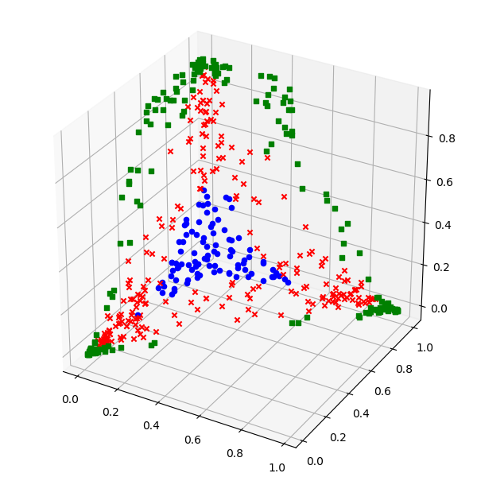|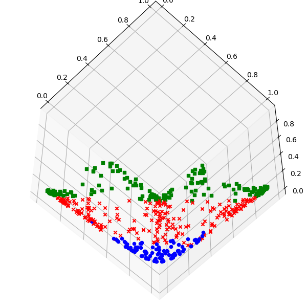|
||通过激活函数的非线性变化，被空间挤压成三角形|从侧面看三种颜色分成了三层|

`net.Z1`的点图的含义是，输入数据经过线性变换后的结果，可以看到由于只是线性变换，所以从侧视角看还只是一个二维平面的样子。

`net.A1`的点图含义是，经过激活函数做非线性变换后的图。由于绿色点比较靠近边缘，所以三维坐标中的每个值在经过Sigmoid激活函数计算后，都有至少一维坐标会是向1靠近的值，所以分散的比较开，形成外围的三角区域；蓝色点正好相反，三维坐标值都趋近于0，所以最后都集中在三维坐标原点的三角区域内；红色点处于前两者之间，因为有很多中间值。

再观察net.A1的侧视图，似乎是已经分层了，蓝点沉积下去，绿点浮上来，红点在中间，像鸡尾酒一样分成了三层，这就给第二层神经网络创造了做一个线性三分类的条件，只需要两个平面，就可以把三者轻松分开了。

## 分类样本不平衡问题

### 11.3.1 什么是样本不平衡

英文名叫做Imbalanced Data。

在一般的分类学习方法中都有一个假设，就是不同类别的训练样本的数量相对平衡。

以二分类为例，比如正负例都各有1000个左右。如果是1200:800的比例，也是可以接受的，但是如果是1900:100，就需要有些措施来解决不平衡问题了，否则最后的训练结果很大可能是忽略了负例，将所有样本都分类为正类了。

### 如何解决样本不平衡问题

#### 平衡数据集

一些经验法则：

- 考虑对大类下的样本（超过1万、十万甚至更多）进行欠采样，即删除部分样本；
- 考虑对小类下的样本（不足1万甚至更少）进行过采样，即添加部分样本的副本；
- 考虑尝试随机采样与非随机采样两种采样方法；
- 考虑对各类别尝试不同的采样比例，比一定是1:1，有时候1:1反而不好，因为与现实情况相差甚远；
- 考虑同时使用过采样（over-sampling）与欠采样（under-sampling）。

#### 尝试其它评价指标 

AUC是最好的评价指标。

#### 尝试产生人工数据样本 

对该类下的所有样本每个属性特征的取值空间中随机选取一个组成新的样本，即属性值随机采样。

有一个系统的构造人工数据样本的方法SMOTE(Synthetic Minority Over-sampling Technique)。SMOTE是一种过采样算法，它构造新的小类样本而不是产生小类中已有的样本的副本，即该算法构造的数据是新样本，原数据集中不存在的。该基于距离度量选择小类别下两个或者更多的相似样本，然后选择其中一个样本，并随机选择一定数量的邻居样本对选择的那个样本的一个属性增加噪声，每次处理一个属性。

使用命令：

```
pip install imblearn
```

#### 尝试一个新的角度理解问题 

转化为异常点检测(anomaly detection)与变化趋势检测问题(change detection)。 

异常点检测即是对那些罕见事件进行识别。如通过机器的部件的振动识别机器故障，又如通过系统调用序列识别恶意程序。这些事件相对于正常情况是很少见的。 

变化趋势检测类似于异常点检测，不同在于其通过检测不寻常的变化趋势来识别。如通过观察用户模式或银行交易来检测用户行为的不寻常改变。

#### 修改现有算法

- 设超大类中样本的个数是极小类中样本个数的L倍，那么在随机梯度下降（SGD，stochastic gradient descent）算法中，每次遇到一个极小类中样本进行训练时，训练L次。
- 将大类中样本划分到L个聚类中，然后训练L个分类器，每个分类器使用大类中的一个簇与所有的小类样本进行训练得到。最后对这L个分类器采取少数服从多数对未知类别数据进行分类，如果是连续值（预测），那么采用平均值。
- 设小类中有N个样本。将大类聚类成N个簇，然后使用每个簇的中心组成大类中的N个样本，加上小类中所有的样本进行训练。

#### 集成学习

1. 首先使用原始数据集训练第一个学习器L1；
2. 然后使用50%在L1学习正确和50%学习错误的那些样本训练得到学习器L2，即从L1中学习错误的样本集与学习正确的样本集中，循环一边采样一个；
3. 接着，使用L1与L2不一致的那些样本去训练得到学习器L3；
4. 最后，使用投票方式作为最后输出。 

# 多入多出的三层神经网络 - 深度非线性多分类

#### 图片数据归一化

```Python
    def __NormalizeData(self, XRawData):
        X_NEW = np.zeros(XRawData.shape)#初始化为0
        x_max = np.max(XRawData)#最大值
        x_min = np.min(XRawData)#最新之
        X_NEW = (XRawData - x_min)/(x_max-x_min)#归一化
        return X_NEW
```
### 定义神经网络

为了完成MNIST分类，我们需要设计一个三层神经网络结构，如图12-2所示。


图12-2 三层神经网络结构

#### 输入层

共计$28\times 28=784$个特征值：

$$
X=\begin{pmatrix}
    x_1 & x_2 & \cdots & x_{784}
  \end{pmatrix}
$$

#### 隐层1

- 权重矩阵$W1$形状为$784\times 64$

$$
W1=\begin{pmatrix}
    w1_{1,1} & w1_{1,2} & \cdots & w1_{1,64} \\\\
    \vdots & \vdots & \cdots & \vdots \\\\
    w1_{784,1} & w1_{784,2} & \cdots & w1_{784,64} 
  \end{pmatrix}
$$

- 偏移矩阵$B1$的形状为$1\times 64$

$$
B1=\begin{pmatrix}
    b1_{1} & b1_{2} & \cdots & b1_{64}
  \end{pmatrix}
$$

- 隐层1由64个神经元构成，其结果为$1\times 64$的矩阵

$$
Z1=\begin{pmatrix}
    z1_{1} & z1_{2} & \cdots & z1_{64}
  \end{pmatrix}
$$
$$
A1=\begin{pmatrix}
    a1_{1} & a1_{2} & \cdots & a1_{64}
  \end{pmatrix}
$$

#### 隐层2

- 权重矩阵$w2$形状为$64\times 16$

$$
W2=\begin{pmatrix}
    w2_{1,1} & w2_{1,2} & \cdots & w2_{1,16} \\\\
    \vdots & \vdots & \cdots & \vdots \\\\
    w2_{64,1} & w2_{64,2} & \cdots & w2_{64,16} 
  \end{pmatrix}
$$

- 偏移矩阵#B2#的形状是$1\times 16$

$$
B2=\begin{pmatrix}
    b2_{1} & b2_{2} & \cdots & b2_{16}
  \end{pmatrix}
$$

- 隐层2由16个神经元构成

$$
Z2=\begin{pmatrix}
    z2_{1} & z2_{2} & \cdots & z2_{16}
  \end{pmatrix}
$$
$$
A2=\begin{pmatrix}
    a2_{1} & a2_{2} & \cdots & a2_{16}
  \end{pmatrix}
$$

#### 输出层

- 权重矩阵$W3$的形状为$16\times 10$

$$
W3=\begin{pmatrix}
    w3_{1,1} & w3_{1,2} & \cdots & w3_{1,10} \\\\
    \vdots & \vdots & \cdots & \vdots \\\\
    w3_{16,1} & w3_{16,2} & \cdots & w3_{16,10} 
  \end{pmatrix}
$$

- 输出层的偏移矩阵$B3$的形状是$1\times 10$

$$
B3=\begin{pmatrix}
    b3_{1}& b3_{2} & \cdots & b3_{10}
  \end{pmatrix}
$$

- 输出层有10个神经元使用Softmax函数进行分类

$$
Z3=\begin{pmatrix}
    z3_{1} & z3_{2} & \cdots & z3_{10}
  \end{pmatrix}
$$
$$
A3=\begin{pmatrix}
    a3_{1} & a3_{2} & \cdots & a3_{10}
  \end{pmatrix}
$$

### 前向计算

我们都是用大写符号的矩阵形式的公式来描述，在每个矩阵符号的右上角是其形状。

#### 隐层1

$$Z1 = X \cdot W1 + B1 \tag{1}$$

$$A1 = Sigmoid(Z1) \tag{2}$$

#### 隐层2

$$Z2 = A1 \cdot W2 + B2 \tag{3}$$

$$A2 = Tanh(Z2) \tag{4}$$

#### 输出层

$$Z3 = A2 \cdot W3  + B3 \tag{5}$$

$$A3 = Softmax(Z3) \tag{6}$$

我们的约定是行为样本，列为一个样本的所有特征，这里是784个特征，因为图片高和宽均为28，总共784个点，把每一个点的值做为特征向量。

两个隐层，分别定义64个神经元和16个神经元。第一个隐层用Sigmoid激活函数，第二个隐层用Tanh激活函数。

输出层10个神经元，再加上一个Softmax计算，最后有$a1,a2,...a10$共十个输出，分别代表0-9的10个数字。

### 反向传播

和以前的两层网络没有多大区别，只不过多了一层，而且用了tanh激活函数，目的是想把更多的梯度值回传，因为tanh函数比sigmoid函数稍微好一些，比如原点对称，零点梯度值大。

#### 输出层

$$dZ3 = A3-Y \tag{7}$$
$$dW3 = A2^{\top} \cdot dZ3 \tag{8}$$
$$dB3=dZ3 \tag{9}$$

#### 隐层2

$$dA2 = dZ3 \cdot W3^{\top} \tag{10}$$
$$dZ2 = dA2 \odot (1-A2 \odot A2) \tag{11}$$
$$dW2 = A1^{\top} \cdot dZ2 \tag{12}$$
$$dB2 = dZ2 \tag{13}$$

#### 隐层1

$$dA1 = dZ2 \cdot W2^{\top} \tag{14}$$
$$dZ1 = dA1 \odot A1 \odot (1-A1) \tag{15}$$
$$dW1 = X^{\top} \cdot dZ1 \tag{16}$$
$$dB1 = dZ1 \tag{17}$$

### 代码实现

在`HelperClass3` / `NeuralNet3.py`中，下面主要列出与两层网络不同的代码。

#### 初始化

```Python
class NeuralNet3(object):
    def __init__(self, hp, model_name):
        ...
        self.wb1 = WeightsBias(self.hp.num_input, self.hp.num_hidden1, self.hp.init_method, self.hp.eta)
        self.wb1.InitializeWeights(self.subfolder, False)
        self.wb2 = WeightsBias(self.hp.num_hidden1, self.hp.num_hidden2, self.hp.init_method, self.hp.eta)
        self.wb2.InitializeWeights(self.subfolder, False)
        self.wb3 = WeightsBias(self.hp.num_hidden2, self.hp.num_output, self.hp.init_method, self.hp.eta)
        self.wb3.InitializeWeights(self.subfolder, False)
```
初始化部分需要构造三组`WeightsBias`对象，请注意各组的输入输出数量，决定了矩阵的形状。

#### 前向计算

```Python
    def forward(self, batch_x):
        # 公式1
        self.Z1 = np.dot(batch_x, self.wb1.W) + self.wb1.B
        # 公式2
        self.A1 = Sigmoid().forward(self.Z1)
        # 公式3
        self.Z2 = np.dot(self.A1, self.wb2.W) + self.wb2.B
        # 公式4
        self.A2 = Tanh().forward(self.Z2)
        # 公式5
        self.Z3 = np.dot(self.A2, self.wb3.W) + self.wb3.B
        # 公式6
        if self.hp.net_type == NetType.BinaryClassifier:
            self.A3 = Logistic().forward(self.Z3)
        elif self.hp.net_type == NetType.MultipleClassifier:
            self.A3 = Softmax().forward(self.Z3)
        else:   # NetType.Fitting
            self.A3 = self.Z3
        #end if
        self.output = self.A3
```
前向计算部分增加了一层，并且使用`Tanh()`作为激活函数。

- 反向传播


```Python
    def backward(self, batch_x, batch_y, batch_a):
        # 批量下降，需要除以样本数量，否则会造成梯度爆炸
        m = batch_x.shape[0]

        # 第三层的梯度输入 公式7
        dZ3 = self.A3 - batch_y
        # 公式8
        self.wb3.dW = np.dot(self.A2.T, dZ3)/m
        # 公式9
        self.wb3.dB = np.sum(dZ3, axis=0, keepdims=True)/m 

        # 第二层的梯度输入 公式10
        dA2 = np.dot(dZ3, self.wb3.W.T)
        # 公式11
        dZ2,_ = Tanh().backward(None, self.A2, dA2)
        # 公式12
        self.wb2.dW = np.dot(self.A1.T, dZ2)/m 
        # 公式13
        self.wb2.dB = np.sum(dZ2, axis=0, keepdims=True)/m 

        # 第一层的梯度输入 公式8
        dA1 = np.dot(dZ2, self.wb2.W.T) 
        # 第一层的dZ 公式10
        dZ1,_ = Sigmoid().backward(None, self.A1, dA1)
        # 第一层的权重和偏移 公式11
        self.wb1.dW = np.dot(batch_x.T, dZ1)/m
        self.wb1.dB = np.sum(dZ1, axis=0, keepdims=True)/m 

    def update(self):
        self.wb1.Update()
        self.wb2.Update()
        self.wb3.Update()
```
反向传播也相应地增加了一层，注意要用对应的`Tanh()`的反向公式。梯度更新时也是三组权重值同时更新。

- 主过程

```Python
if __name__ == '__main__':
    ......
    n_input = dataReader.num_feature
    n_hidden1 = 64
    n_hidden2 = 16
    n_output = dataReader.num_category
    eta = 0.2
    eps = 0.01
    batch_size = 128
    max_epoch = 40

    hp = HyperParameters3(n_input, n_hidden1, n_hidden2, n_output, eta, max_epoch, batch_size, eps, NetType.MultipleClassifier, InitialMethod.Xavier)
    net = NeuralNet3(hp, "MNIST_64_16")
    net.train(dataReader, 0.5, True)
    net.ShowTrainingTrace(xline="iteration")
```
超参配置：第一隐层64个神经元，第二隐层16个神经元，学习率0.2，批大小128，Xavier初始化，最大训练40个epoch。

### 运行结果

损失函数值和准确度值变化曲线如图12-3。


图12-3 训练过程中损失函数和准确度的变化

打印输出部分：

```
...
epoch=38, total_iteration=16769
loss_train=0.012860, accuracy_train=1.000000
loss_valid=0.100281, accuracy_valid=0.969400
epoch=39, total_iteration=17199
loss_train=0.006867, accuracy_train=1.000000
loss_valid=0.098164, accuracy_valid=0.971000
time used: 25.697904109954834
testing...
0.9749
```

在测试集上得到的准确度为97.49%，比较理想。

## 梯度检查

为了确认代码中反向传播计算的梯度是否正确，可以采用梯度检验（gradient check）的方法。通过计算数值梯度，得到梯度的近似值，然后和反向传播得到的梯度进行比较，若两者相差很小的话则证明反向传播的代码是正确无误的。

### 实例说明

比如一个函数：

$$f(x) = x^2 + 3x$$

我们看一下它在$x=2$处的数值微分，令$h = 0.001$：

$$
\begin{aligned}
f(x+h) &= f(2+0.001) \\\\
&= (2+0.001)^2 + 3 \times (2+0.001) \\\\
&=10.007001
\end{aligned}
$$
$$
\begin{aligned}
f(x-h) &= f(2-0.001) \\\\
&= (2-0.001)^2 + 3 \times (2-0.001) \\\\
&=9.993001
\end{aligned}
$$
$$
\frac{f(x+h)-f(x-h)}{2h}=\frac{10.007001-9.993001}{2 \times 0.001}=7 \tag{10}
$$

再看它的数学解析解：

$$f'(x)=2x+3$$
$$f'(x|_{x=2})=2 \times 2+3=7 \tag{11}$$

可以看到公式10和公式11的结果一致。当然在实际应用中，一般不可能会完全相等，只要两者的误差小于`1e-5`以下，我们就认为是满足精度要求的。

## 学习率与批大小

在梯度下降公式中：

$$
w_{t+1} = w_t - \frac{\eta}{m} \sum_i^m \nabla J(w,b) \tag{1}
$$

其中，$\eta$是学习率，m是批大小。所以，学习率与批大小是对梯度下降影响最大的两个因子。


### 初始学习率的选择

找最优初始学习率，方法非常简单：

1. 首先我们设置一个非常小的初始学习率，比如`1e-5`；
2. 然后在每个`batch`之后都更新网络，计算损失函数值，同时增加学习率；
3. 最后我们可以描绘出学习率的变化曲线和loss的变化曲线，从中就能够发现最好的学习率。

### 学习率的后期修正

可以在开始时，把学习率设置大一些，让准确率快速上升，损失值快速下降；到了一定阶段后，可以换用小一些的学习率继续训练。用公式表示：

$$
LR_{new}=LR_{current} * DecayRate^{GlobalStep/DecaySteps} \tag{4}
$$

### 学习率与批大小的关系

说明当批大小小到一定数量级后，学习率要和批大小匹配，较大的学习率配和较大的批量，反之亦然。

#### 数值理解

如果上述一些文字不容易理解的话，我们用一个最简单的示例来试图说明一下学习率与批大小的正比关系。


图12-14 学习率与批大小关系的数值理解

batch size和学习率的关系可以大致总结如下：

1. 增加batch size，需要增加学习率来适应，可以用线性缩放的规则，成比例放大
2. 到一定程度，学习率的增加会缩小，变成batch size的$\sqrt m$倍
3. 到了比较极端的程度，无论batch size再怎么增加，也不能增加学习率了

## mooc神经网络第三章学习

### 了解卷积神经网络性能的优化方法

Im2col 优化算法：作为早期的深度学习框架，Caffe 中卷积的实现采用的是基于 im2col 的方法，至今仍是卷积重要的优化方法之一。 2.内存布局与卷积性能：主要有 NCHW 和 NHWC 两种，不同的内存布局会影响计算运行时访问存储器的模式，特别是在运行矩阵乘时。 3.空间组合优化算法 4.Winograd 优化算法 5.间接卷积优化算法

### 为什么常用3X3卷积核？

(1)3x3是最小的能够捕获像素八邻域信息的尺寸。(2)两个3x3的堆叠卷基层的有限感受野是5x5；三个3x3的堆叠卷基层的感受野是7x7，故可以通过小尺寸卷积层的堆叠替代大尺寸卷积层，并且感受野大小不变。所以可以把三个3x3的filter看成是一个7x7filter的分解中间层有非线性的分解, 并且起到隐式正则化的作用。(3)多个3x3的卷基层比一个大尺寸filter卷基层有更多的非线性（更多层的非线性函数，使用了3个非线性激活函数），使得判决函数更加具有判决性。(4)多个3x3的卷积层比一个大尺寸的filter有更少的参数，假设卷积层的输入和输出的特征图大小相同为C，那么三个3x3的卷积层参数个数3x((3x3xC)xC)=27C2；一个（7x7xC）xC的卷积层参数为49C2。前者可以表达出输入数据中更多个强力特征，使用的参数也更少。唯一的不足是，在进行反向传播时，中间的卷积层可能会导致占用更多的内存；

### 了解卷积神经网络的发展

日本学者福岛邦彦提出的neocognitron模型是最早被提出的深度学习算法之一。第一个卷积神经网络是1987年由Alexander Waibel等提出的时间延迟网络。1988年，Wei Zhang提出了第一个二维卷积神经网络：平移不变人工神经网络。Yann LeCun在1989年同样构建了应用于计算机视觉问题的卷积神经网络。1998年Yann LeCun及其合作者构建了更加完备的卷积神经网络LeNet-5并在手写数字的识别问题中取得成功。自2012年的AlexNet开始，得到GPU计算集群支持的复杂卷积神经网络多次成为ImageNet大规模视觉识别竞赛的优胜算法。

#### 理解卷积神经网络

卷积神经网络CNN和在它之前的ANN网络相比，拥有更强的参数共享性和网络稀疏性。CNN通常由输入层，隐藏层，输出层组成，其中隐藏层中常见的有卷积层，池化层和全连接层。其常见的架构模式为一个或几个conv后跟着一个pooling，以此为一个单元，重复数次。随后是几个全连接层，最后是一个softmax（或sigmoid，tanh等）。相较于单纯使用全连接层建构的神经网络相比，在提升性能的同时，大量减少了参数量，降低了计算成本。其主要原因为：1.参数共享，以图像分类为例，每个filter以及output都可以在input的不同区域中使用同样的参数，一边提取其他特征。整张图片会共享数个filter，提取效果也很好。2.系数连接，区别于全连接层，每个隐藏单元的output都只作为下一层相邻的数个隐层单元的input，为不再是全部。每一个像素的局部影响被放大，而全局影响被减弱。

#### 池化操作的作用

下采样层也叫池化层，其具体操作与卷基层的操作基本相同，只不过下采样的卷积核为只取对应位置的最大值、平均值等（最大池化、平均池化），并且不经过反向传播的修改。池化的作用：减小输出大小 和 降低过拟合。降低过拟合是减小输出大小的结果，它同样也减少了后续层中的参数的数量。借助池化，网络存储可以有效提升存储的利用率。

#### Batch normalization的作用

1.BN往往用在卷积层之后，激活函数之前(比如对于darknet-53来说，conv+BN+relu成为一个标配，构成最小组件)。当然，BN不一定用在conv之后，但用在激活函数之前是几乎必须的(这样才能发挥它的作用)。我们把神经网络各层之间的传递称为特征图(feature map)，特征图在传递的过程中，就需要用BN进行调整。2.BN操作步骤：第一步，我们获得了一个mini-batch的输入в = {x1,..., xm}，可以看出batch size就是m。第二步，求这个batch的均值μ和方差σ第三步，对所有xi ∈в，进行一个标准化，得到xi`。第四步，对xi`做一个线性变换，得到输出yi。3.BN就是调整每层网络输出数据的分布，使其进入激活函数的作用区。激活函数的作用区就是指原点附近的区域，梯度弥散率低，区分率高。同时，BN会在训练过程中，自己调节数据分布，使其“更合理”地进入激活函数。BN有以下特点：1. 加速收敛。减少epoch轮数，因为不必训练神经网络去适应数据的分布。同时，完美地使用了激活函数对数据的“修剪”，减少梯度弥散。同时，学习率也可以大一点。2. 准确率更高

#### 常用的深度学习数据增强方法

1、有监督的数据增强：单样本数据增强：几何变换类、颜色变换类多样本数据增强：SMOTE（基于插值）、SamplePairing（训练集中随机抽取两张图片分别经过基础数据增强操作处理后经像素以取平均值的形式叠加合成一个新的样本，标签为原样本标签中的一种）、mixup（线性插值）2、无监督的数据增强：(1) 通过模型学习数据的分布，随机生成与训练数据集分布一致的图片，代表方法GAN。(2) 通过模型，学习出适合当前任务的数据增强方法，代表方法AutoAugment

## 学习总结

- 激活函数的基本作用是什么？
- 激活函数的基本性质是什么？
- 挤压型激活函数有哪些？
- 对数几率函数公式是什么？
- Tanh函数公式和图像是什么？
- 半线性激活函数有哪些？
- ReLU函数公式和图像是什么？
- Leaky ReLU函数公式和图像是什么？相对于ReLU函数优点是什么？
- 用多项式回归法拟合正弦曲线用几次多项式拟合？
- 用多项式回归法拟合复合函数曲线用几次多项式拟合？
- 几次多项式拟合的算法怎么写？
- 验证与测试的基本概念是什么？
- 交叉验证的传统和现代机器学习的区别
- 留出法是什么？
- 双层神经网络实现非线性回归神经网络结构的定义是什么？
- 图形是什么？
- 公式怎么推导
- 代码怎么实现
- 复合曲线的拟合在隐层只有一个和两个神经元的情况
- 正弦曲线的拟合在隐层只有两个和三个神经元的情况
- 广义的回归/拟合是什么
- 非线性回归的工作原理是什么
- 比较多项式回归和双层神经网络解法
- 可调的参数有几个？哪几个？
- 网格搜索是什么？
- 各种超参数的作用是什么？
- 随机搜索过程是什么？
- 三个参数调整分别会发生什么？
- 随机搜索与网格搜索的对比
- 二分类模型的评估标准
- Kappa statics 是什么，公式是什么
- 双层神经网络的分类
- 非线性二分类神经网络结构的定义
- 非线性多分类的工作原理是什么
- 什么是样本不平衡
- 如何解决样本不平衡问题
- 深度非线性多分类神经网络的定义

## 心得体会

从Step4开始，我们进入双层神经网络的学习，并解决非线性问题。
在两层神经网络之间，必须有激活函数连接，从而加入非线性因素，提高神经网络的能力。所以，我们先从激活函数学起，一类是挤压型的激活函数，常用于简单网络的学习；另一类是半线性的激活函数，常用于深度网络的学习。
接下来我们将验证著名的万能近似定理，建立一个双层的神经网络，来拟合一个比较复杂的函数。
在上面的双层神经网络中，已经出现了很多的超参，都会影响到神经网络的训练结果。所以在完成了基本的拟合任务之后，我们将尝试着调试这些参数，得到又快又好的训练效果，从而得到超参调试的第一手经验。
我们在第三步中学习了线性分类，在本部分中，我们将学习更复杂的分类问题，比如，在很多年前，两位著名的学者证明了感知机无法解决逻辑中的异或问题，从而使感知机这个研究领域陷入了长期的停滞。我们将会在使用双层网络解决异或问题。
异或问题是个简单的二分类问题，因为毕竟只有4个样本数据，我们会用更复杂的数据样本来学习非线性多分类问题，并理解其工作原理。
然后我们将会用一个稍微复杂些的二分类例子，来说明在二维平面上，神经网络是通过怎样的神奇的线性变换加激活函数压缩，把线性不可分的问题转化为线性可分问题的。
解决完二分类问题，我们将学习如何解决更复杂的三分类问题，由于样本的复杂性，必须在隐层使用多个神经元才能完成分类任务。
最后我们将搭建一个三层神经网络，来解决MNIST手写数字识别问题，并学习使用梯度检查来帮助我们测试反向传播代码的正确性。
数据集的使用，是深度学习的一个基本技能，开发集、验证集、测试集，合理地使用才能得到理想的泛化能力强的模型。

此次学习我也学习到了

1. 更加熟练的掌握了markdown的阅读与书写规则
2. 逐渐理解掌握了基于Python代码的神经网络代码
3. 学习了python的进阶
4. 掌握了非线性回归和非线性分类的思想
5. 安装了OPENVIVN软件，并运行相关程序
6. 学习了MOOC的第三章CNN卷积神经网络