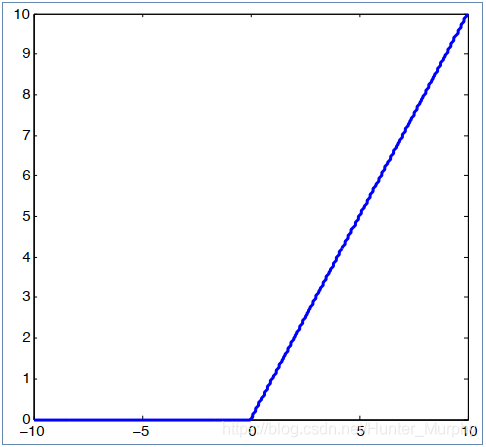
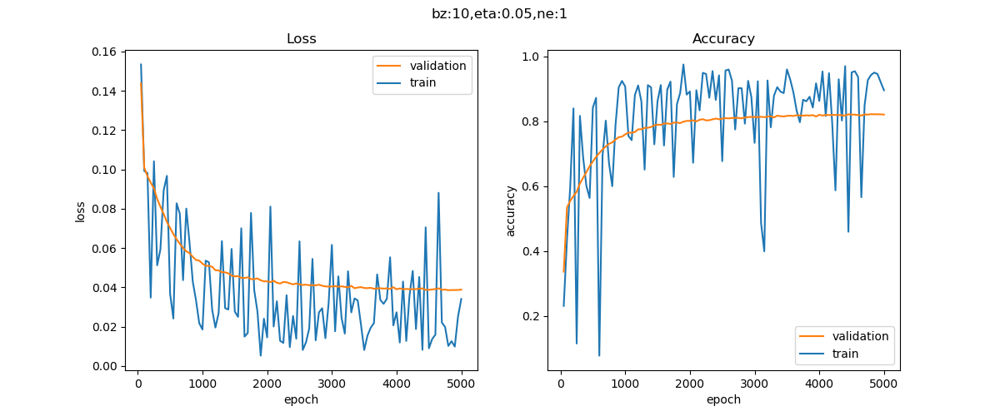
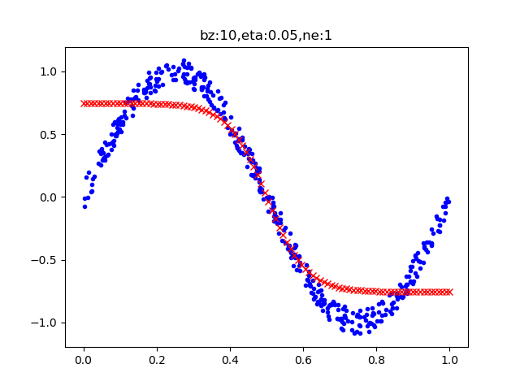
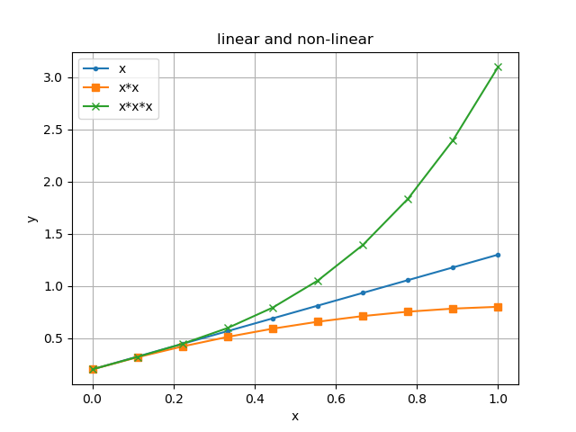
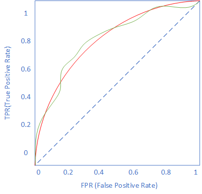
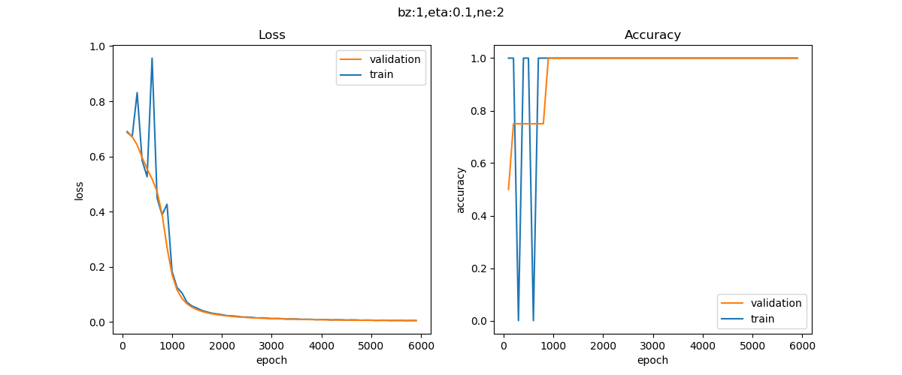
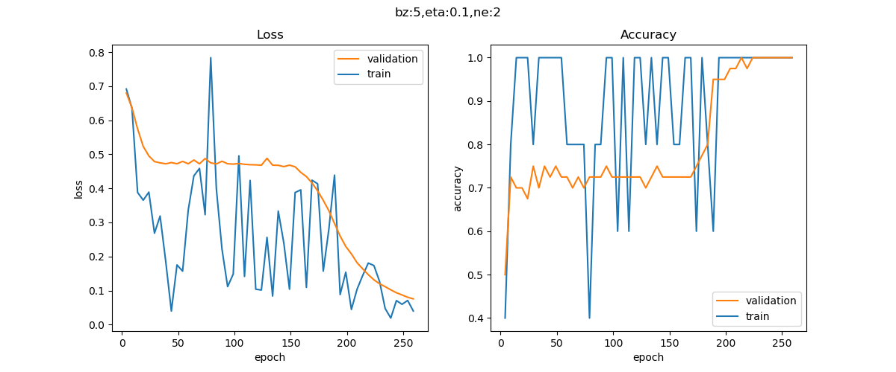
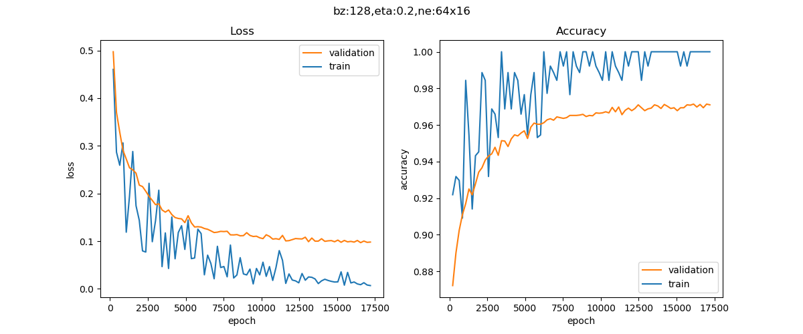

201809058  Wang Yulong  第三次作业

#  <font face="楷体" color=#12754><center>**1.非线性回归**</center></font>
<font face="楷体">

## 激活函数

神经网络中的一个神经元，假设该神经元有三个输入，分别为$x_1,x_2,x_3$，那么：

$$z=x_1 w_1 + x_2 w_2 + x_3 w_3 +...+x_n w_n+b \tag{1}$$
$$a = \sigma(z) \tag{2}$$


<center>激活函数</center>


激活函数的基本性质：

+ 非线性：线性的激活函数和没有激活函数一样；
+ 可导性：做误差反向传播和梯度下降，必须要保证激活函数的可导性；
+ 单调性：单一的输入会得到单一的输出，较大值的输入得到较大值的输出。

## 何时使用激活函数

神经网络不管有多少层，最后的输出层决定了这个神经网络能干什么。在单层神经网络中，我们学习到了表1所示的内容。

表1 单层的神经网络的参数与功能

|网络|输入|输出|激活函数|分类函数|功能|
|---|---|---|---|---|---|
|单层|单变量|单输出|无|无|线性回归|
|单层|多变量|单输出|无|无|线性回归|
|单层|多变量|单输出|无|二分类函数|二分类|
|单层|多变量|多输出|无|多分类函数|多分类|

从上表可以看到，我们一直没有使用激活函数，而只使用了分类函数。对于多层神经网络也是如此，在最后一层只会用到分类函数来完成二分类或多分类任务，如果是拟合任务，则不需要分类函数。

简言之：

1. 神经网络最后一层不需要激活函数
2. 激活函数只用于连接前后两层神经网络

## <font color=yellow>挤压型激活函数</font>

1.定义：当输入值域的绝对值较大的时候，其输出在两端是饱和的，都具有S形的函数曲线以及压缩输入值域的作用的函数。

### <font color=red> Logistic函数</font>
### 公式

$$Sigmoid(z) = \frac{1}{1 + e^{-z}} \rightarrow a \tag{1}$$

### 导数

$$Sigmoid'(z) = a(1 - a) \tag{2}$$

注意，如果是矩阵运算的话，需要在公式2中使用$\odot$符号表示按元素的矩阵相乘：$a\odot (1-a)$，后面不再强调。

推导过程如下：

令：$u=1,v=1+e^{-z}$ 则：

$$
\begin{aligned}
Sigmoid'(z)&= (\frac{u}{v})'=\frac{u'v-v'u}{v^2} \\\\
&=\frac{0-(1+e^{-z})'}{(1+e^{-z})^2}=\frac{e^{-z}}{(1+e^{-z})^2} \\\\
&=\frac{1+e^{-z}-1}{(1+e^{-z})^2}=\frac{1}{1+e^{-z}}-(\frac{1}{1+e^{-z}})^2 \\\\
&=a-a^2=a(1-a)
\end{aligned}
$$

### 值域

- 输入值域：$(-\infty, \infty)$
- 输出值域：$(0,1)$
- 导数值域：$(0,0.25]$

### 函数图像


数值计算：

1. 求出当前输入的值

$$a=\frac{1}{1 + e^{-z}} = 0.9$$
$$z = \ln{9}$$

2. 求出当前梯度

$$\delta = a \times (1 - a) = 0.9 \times 0.1= 0.09$$

3. 根据梯度更新当前输入值

$$z_{new} = z - \eta \times \delta = \ln{9} - 0.2 \times 0.09 = \ln(9) - 0.018$$

4. 判断当前函数值是否接近0.5

$$a=\frac{1}{1 + e^{-z_{new}}} = 0.898368$$

5. 重复步骤2-3，直到当前函数值接近0.5

如果用一个程序来计算的话，需要迭代67次，才可以从0.9趋近0.5。

### <font color=green>**Tanh函数**</font>

TanHyperbolic，即双曲正切函数

### 公式  
$$Tanh(z) = \frac{e^{z} - e^{-z}}{e^{z} + e^{-z}} = (\frac{2}{1 + e^{-2z}}-1) \rightarrow a \tag{3}$$
即
$$Tanh(z) = 2 \cdot Sigmoid(2z) - 1 \tag{4}$$

### 导数公式

$$Tanh'(z) = (1 + a)(1 - a)$$

利用基本导数公式23，令：$u={e^{z}-e^{-z}}，v=e^{z}+e^{-z}$ 则有：

$$
\begin{aligned}
Tanh'(z)&=\frac{u'v-v'u}{v^2} \\\\
&=\frac{(e^{z}-e^{-z})'(e^{z}+e^{-z})-(e^{z}+e^{-z})'(e^{z}-e^{-z})}{(e^{z}+e^{-z})^2} \\\\
&=\frac{(e^{z}+e^{-z})(e^{z}+e^{-z})-(e^{z}-e^{-z})(e^{z}-e^ {-z})}{(e^{z}+e^{-z})^2} \\\\
&=\frac{(e^{z}+e^{-z})^2-(e^{z}-e^{-z})^2}{(e^{z}+e^{-z})^2} \\\\
&=1-(\frac{(e^{z}-e^{-z}}{e^{z}+e^{-z}})^2=1-a^2
\end{aligned}
$$

### 值域

- 输入值域：$(-\infty,\infty)$
- 输出值域：$(-1,1)$
- 导数值域：$(0,1)$

### 函数图像


## <font color=yellow>半线性激活函数</font>
优点：解决梯度消失；加快收敛速度；


ReLU函数 

Rectified Linear Unit，修正线性单元，线性整流函数，斜坡函数。

#### 公式

$$ReLU(z) = max(0,z) = \begin{cases} 
  z, & z \geq 0 \\\\ 
  0, & z < 0 
\end{cases}$$

#### 导数

$$ReLU'(z) = \begin{cases} 1 & z \geq 0 \\\\ 0 & z < 0 \end{cases}$$

#### 值域

- 输入值域：$(-\infty, \infty)$
- 输出值域：$(0,\infty)$
- 导数值域：$（0,1）$



Leaky ReLU函数

LReLU，带泄露的线性整流函数。

#### 公式

$$LReLU(z) = \begin{cases} z & z \geq 0 \\\\ \alpha \cdot z & z < 0 \end{cases}$$

#### 导数

$$LReLU'(z) = \begin{cases} 1 & z \geq 0 \\\\ \alpha & z < 0 \end{cases}$$

#### 值域

输入值域：$(-\infty, \infty)$

输出值域：$(-\infty,\infty)$

导数值域：$({\alpha},1)$


Softplus函数

#### 公式

$$Softplus(z) = \ln (1 + e^z)$$

#### 导数

$$Softplus'(z) = \frac{e^z}{1 + e^z}$$

#### 

输入值域：$(-\infty, \infty)$

输出值域：$(0,\infty)$

导数值域：$(0,1)$


----

#  <font face="楷体" color=#12754><center>**2.非线性回归**</center></font>


## 1.定义引入：
原则上说，如果你有足够的耐心，愿意花很高的时间成本和计算资源，总可以用多项式回归的方式来解决这个问题，但是，在本章，我们将会学习另外一个定理：前馈神经网络的通用近似定理。

上面这条“蛇形”曲线，实际上是由下面这个公式添加噪音后生成的：

$$y=0.4x^2 + 0.3x\sin(15x) + 0.01\cos(50x)-0.3$$

我们特意把数据限制在[0,1]之间，避免做归一化的麻烦。要是觉得这个公式还不够复杂，大家可以用更复杂的公式去自己做试验。

以上问题可以叫做非线性回归，即自变量X和因变量Y之间不是线性关系。常用的传统的处理方法有线性迭代法、分段回归法、迭代最小二乘法等。在神经网络中，解决这类问题的思路非常简单，就是使用带有一个隐层的两层神经网络。

复杂曲线样本数据

|样本|x|y|
|---|---|---|
|1|0.606|-0.113|
|2|0.129|-0.269|
|3|0.582|0.027|
|...|...|...|
|1000|0.199|-0.281|


平均绝对误差

MAE（Mean Abolute Error）。

$$MAE=\frac{1}{m} \sum_{i=1}^m \lvert a_i-y_i \rvert \tag{1}$$

对异常值不如均方差敏感，类似中位数。

绝对平均值率误差

MAPE（Mean Absolute Percentage Error）。

$$MAPE=\frac{100}{m} \sum^m_{i=1} \left\lvert {a_i - y_i \over y_i} \right\rvert \tag{2}$$

和方差

SSE（Sum Squared Error）。

$$SSE=\sum_{i=1}^m (a_i-y_i)^2 \tag{3}$$

均方差

MSE（Mean Squared Error）。

$$MSE = \frac{1}{m} \sum_{i=1}^m (a_i-y_i)^2 \tag{4}$$

上面的几种衡量标准针对不同的模型会有不同的值。比如说预测房价，那么误差单位就是元，比如3000元、11000元等。如果预测身高就可能是0.1、0.2米之类的。也就是说，对于不同的场景，会有不同量纲，因而也会有不同的数值，无法用一句话说得很清楚，必须带一大堆条件才能表达完整。

## 2.曲线拟合

隐层只有一个神经元的情况
令n_hidden=1，并指定模型名称为sin_111



<center>训练过程



 拟合效果图</center>

 从图2.1可以看到，损失值到0.04附近就很难下降了

 ## 3.非线性回归的工作原理


 单层神经网络的多项式回归法，需要$x,x^2,x^3$三个特征值，组成如下公式来得到拟合结果：

$$
z = x \cdot w_1 + x^2 \cdot w_2 + x^3 \cdot w_3 + b \tag{1}
$$

我们可以回忆一下第5章学习的多变量线性回归问题，公式1实际上是把一维的x的特征信息，增加到了三维，然后再使用多变量线性回归来解决问题的。本来一维的特征只能得到线性的结果，但是三维的特征就可以得到非线性的结果，这就是多项式拟合的原理。

我们用具体的数值计算方式来理解一下其工作过程。

```Python
import numpy as np
import matplotlib.pyplot as plt

if __name__ == '__main__':
    x = np.linspace(0,1,10)
    w = 1.1
    b = 0.2
    y = x * w + b
    p1, = plt.plot(x,y, marker='.')

    x2 = x*x
    w2 = -0.5
    y2 = x * w + x2 * w2 + b
    p2, = plt.plot(x, y2, marker='s')

    x3 = x*x*x
    w3 = 2.3
    y3 = x * w + x2 * w2 + x3 * w3 + b
    p3, = plt.plot(x, y3, marker='x')

    plt.grid()
    plt.xlabel("x")
    plt.ylabel("y")
    plt.title("linear and non-linear")
    plt.legend([p1,p2,p3], ["x","x*x","x*x*x"])
    plt.show()
```

上述代码完成了如下任务：

1. 定义 $[0,1]$ 之间的等距的10个点
2. 使用 $w=1.1,b=0.2$ 计算一个线性回归数值`y`
3. 使用 $w=1.1,w2=-0.5,b=0.2$ 计算一个二项式回归数值`y2`
4. 使用 $w=1.1,w2=-0.5,w3=2.3,b=0.2$ 计算一个三项式回归数值`y3`
5. 绘制出三条曲线，如图3.1所示


<center>图3.1 回归曲线图</center>


---
# <font color=yellow><center>3.多入单出的神经网络</center></font>

## 1.非线性二分类问题

二分类模型的评估标准

#### 准确率 Accuracy

也可以称之为精度，我们在本书中混用这两个词。

对于二分类问题，假设测试集上一共1000个样本，其中550个正例，450个负例。测试一个模型时，得到的结果是：521个正例样本被判断为正类，435个负例样本被判断为负类，则正确率计算如下：

$$Accuracy=(521+435)/1000=0.956$$

即正确率为95.6%。这种方式对多分类也是有效的，即三类中判别正确的样本数除以总样本数，即为准确率。

但是这种计算方法丢失了很多细节，比如：是正类判断的精度高还是负类判断的精度高呢？因此，我们还有如下一种评估标准。

#### 混淆矩阵

还是用上面的例子，如果具体深入到每个类别上，会分成4部分来评估：

- 正例中被判断为正类的样本数（TP-True Positive）：521
- 正例中被判断为负类的样本数（FN-False Negative）：550-521=29
- 负例中被判断为负类的样本数（TN-True Negative）：435
- 负例中被判断为正类的样本数（FP-False Positive）：450-435=15

可以用下图来帮助理解。


二分类中四种类别的示意图

- 左侧实心圆点是正类，右侧空心圆是负类；
- 在圆圈中的样本是被模型判断为正类的，圆圈之外的样本是被判断为负类的；
- 左侧圆圈外的点是正类但是误判为负类，右侧圆圈内的点是负类但是误判为正类；
- 左侧圆圈内的点是正类且被正确判别为正类，右侧圆圈外的点是负类且被正确判别为负类。

用表格的方式描述矩阵的话是表10-1的样子。

表10-1 四类样本的矩阵关系

|预测值|被判断为正类|被判断为负类|Total|
|---|---|---|---|
|样本实际为正例|TP-True Positive|FN-False Negative|Actual Positive=TP+FN|
|样本实际为负例|FP-False Positive|TN-True Negative|Actual Negative=FP+TN|
|Total|Predicated Postivie=TP+FP|Predicated Negative=FN+TN|

从混淆矩阵中可以得出以下统计指标：

- 准确率 Accuracy

$$
\begin{aligned}
Accuracy &= \frac{TP+TN}{TP+TN+FP+FN} \\\\
&=\frac{521+435}{521+29+435+15}=0.956
\end{aligned}
$$

这个指标就是上面提到的准确率，越大越好。

- 精确率/查准率 Precision

分子为被判断为正类并且真的是正类的样本数，分母是被判断为正类的样本数。越大越好。

$$
Precision=\frac{TP}{TP+FP}=\frac{521}{521+15}=0.972
$$

- 召回率/查全率 Recall

$$
Recall = \frac{TP}{TP+FN}=\frac{521}{521+29}=0.947
$$

分子为被判断为正类并且真的是正类的样本数，分母是真的正类的样本数。越大越好。

- TPR - True Positive Rate 真正例率

$$
TPR = \frac{TP}{TP + FN}=Recall=0.947
$$

- FPR - False Positive Rate 假正例率

$$
FPR = \frac{FP}{FP+TN}=\frac{15}{15+435}=0.033
$$

分子为被判断为正类的负例样本数，分母为所有负类样本数。越小越好。

- 调和平均值 F1

$$
\begin{aligned}
F1&=\frac{2 \times Precision \times Recall}{recision+Recall}\\\\
&=\frac{2 \times 0.972 \times 0.947}{0.972+0.947}=0.959
\end{aligned}
$$

该值越大越好。

- ROC曲线与AUC

ROC，Receiver Operating Characteristic，接收者操作特征，又称为感受曲线（Sensitivity Curve），是反映敏感性和特异性连续变量的综合指标，曲线上各点反映着相同的感受性，它们都是对同一信号刺激的感受性。
ROC曲线的横坐标是FPR，纵坐标是TPR。

AUC，Area Under Roc，即ROC曲线下面的面积。

在二分类器中，如果使用Logistic函数作为分类函数，可以设置一系列不同的阈值，比如[0.1,0.2,0.3...0.9]，把测试样本输入，从而得到一系列的TP、FP、TN、FN，然后就可以绘制如下曲线，如图10-4。


 ROC曲线图

图中红色的曲线就是ROC曲线，曲线下的面积就是AUC值，取值区间为$[0.5,1.0]$，面积越大越好。

- ROC曲线越靠近左上角，该分类器的性能越好。
- 对角线表示一个随机猜测分类器。
- 若一个学习器的ROC曲线被另一个学习器的曲线完全包住，则可判断后者性能优于前者。
- 若两个学习器的ROC曲线没有包含关系，则可以判断ROC曲线下的面积，即AUC，谁大谁好。

当然在实际应用中，取决于阈值的采样间隔，红色曲线不会这么平滑，由于采样间隔会导致该曲线呈阶梯状。

既然已经这么多标准，为什么还要使用ROC和AUC呢？因为ROC曲线有个很好的特性：当测试集中的正负样本的分布变换的时候，ROC曲线能够保持不变。在实际的数据集中经常会出现样本类不平衡，即正负样本比例差距较大，而且测试数据中的正负样本也可能随着时间变化。

#### Kappa statics 

Kappa值，即内部一致性系数(inter-rater,coefficient of internal consistency)，是作为评价判断的一致性程度的重要指标。取值在0～1之间。

$$
Kappa = \frac{p_o-p_e}{1-p_e}
$$

其中，$p_0$是每一类正确分类的样本数量之和除以总样本数，也就是总体分类精度。$p_e$的定义见以下公式。

- Kappa≥0.75两者一致性较好；
- 0.75>Kappa≥0.4两者一致性一般；
- Kappa<0.4两者一致性较差。 

该系数通常用于多分类情况，如：

||实际类别A|实际类别B|实际类别C|预测总数|
|--|--|--|--|--|
|预测类别A|239|21|16|276|
|预测类别B|16|73|4|93|
|预测类别C|6|9|280|295|
|实际总数|261|103|300|664|


$$
p_o=\frac{239+73+280}{664}=0.8916
$$
$$
p_e=\frac{261 \times 276 + 103 \times 93 + 300 \times 295}{664 \times 664}=0.3883
$$
$$
Kappa = \frac{0.8916-0.3883}{1-0.3883}=0.8228
$$

数据一致性较好，说明分类器性能好。

#### Mean absolute error 和 Root mean squared error 

平均绝对误差和均方根误差，用来衡量分类器预测值和实际结果的差异，越小越好。
## 2.逻辑异或门


#### 准备数据

异或数据比较简单，只有4个记录，所以就hardcode在此，不用再建立数据集了。这也给读者一个机会了解如何从`DataReader`类派生出一个全新的子类`XOR_DataReader`。

比如在下面的代码中，我们覆盖了父类中的三个方法：

- `init()` 初始化方法：因为父类的初始化方法要求有两个参数，代表train/test数据文件
- `ReadData()`方法：父类方法是直接读取数据文件，此处直接在内存中生成样本数据，并且直接令训练集等于原始数据集（不需要归一化），令测试集等于训练集
- `GenerateValidationSet()`方法，由于只有4个样本，所以直接令验证集等于训练集

因为`NeuralNet2`中的代码要求数据集比较全，有训练集、验证集、测试集，为了已有代码能顺利跑通，我们把验证集、测试集都设置成与训练集一致，对于解决这个异或问题没有什么影响。
### 代码实现:
```Python
class XOR_DataReader(DataReader):
    def ReadData(self):
        self.XTrainRaw = np.array([0,0,0,1,1,0,1,1]).reshape(4,2)
        self.YTrainRaw = np.array([0,1,1,0]).reshape(4,1)
        self.XTrain = self.XTrainRaw
        self.YTrain = self.YTrainRaw
        self.num_category = 1
        self.num_train = self.XTrainRaw.shape[0]
        self.num_feature = self.XTrainRaw.shape[1]
        self.XTestRaw = self.XTrainRaw
        self.YTestRaw = self.YTrainRaw
        self.XTest = self.XTestRaw
        self.YTest = self.YTestRaw
        self.num_test = self.num_train

    def GenerateValidationSet(self, k = 10):
        self.XVld = self.XTrain
        self.YVld = self.YTrain
```

#### 测试函数

与第6章中的逻辑与门和或门一样，我们需要神经网络的运算结果达到一定的精度，也就是非常的接近0，1两端，而不是说勉强大于0.5就近似为1了，所以精度要求是误差绝对值小于`1e-2`。

```Python
def Test(dataReader, net):
    print("testing...")
    X,Y = dataReader.GetTestSet()
    A = net.inference(X)
    diff = np.abs(A-Y)
    result = np.where(diff < 1e-2, True, False)
    if result.sum() == dataReader.num_test:
        return True
    else:
        return False
```

#### 主过程代码

```Python
if __name__ == '__main__':
    ......
    n_input = dataReader.num_feature
    n_hidden = 2
    n_output = 1
    eta, batch_size, max_epoch = 0.1, 1, 10000
    eps = 0.005
    hp = HyperParameters2(n_input, n_hidden, n_output, eta, max_epoch, batch_size, eps, NetType.BinaryClassifier, InitialMethod.Xavier)
    net = NeuralNet2(hp, "Xor_221")
    net.train(dataReader, 100, True)
    ......
```

此处的代码有几个需要强调的细节：

- `n_input = dataReader.num_feature`，值为2，而且必须为2，因为只有两个特征值
- `n_hidden=2`，这是人为设置的隐层神经元数量，可以是大于2的任何整数
- `eps`精度=0.005是后验知识，笔者通过测试得到的停止条件，用于方便案例讲解
- 网络类型是`NetType.BinaryClassifier`，指明是二分类网络
- 最后要调用`Test`函数验证精度

### 运行结果

经过快速的迭代后，会显示训练过程如下图所示。



训练过程中的损失函数值和准确率值的变化

可以看到二者的走势很理想。

同时在控制台会打印一些信息，最后几行如下：

```
......
epoch=5799, total_iteration=23199
loss_train=0.005553, accuracy_train=1.000000
loss_valid=0.005058, accuracy_valid=1.000000
epoch=5899, total_iteration=23599
loss_train=0.005438, accuracy_train=1.000000
loss_valid=0.004952, accuracy_valid=1.000000
W= [[-7.10166559  5.48008579]
 [-7.10286572  5.48050039]]
B= [[ 2.91305831 -8.48569781]]
W= [[-12.06031599]
 [-12.26898815]]
B= [[5.97067802]]
testing...
1.0
None
testing...
A2= [[0.00418973]
 [0.99457721]
 [0.99457729]
 [0.00474491]]
True
```
一共用了5900个`epoch`，达到了指定的`loss`精度（0.005），`loss_valid`是0.004991，刚好小于0.005时停止迭代。

我们特意打印出了`A2`值，即网络推理结果，如下表所示。

异或计算值与神经网络推理值的比较:

|x1|x2|XOR|Inference|diff|
|---|---|---|---|---|
|0|0|0|0.0041|0.0041|
|0|1|1|0.9945|0.0055|
|1|0|1|0.9945|0.0055|
|1|1|0|0.0047|0.0047|

表中第四列的推理值与第三列的`XOR`结果非常的接近，继续训练的话还可以得到更高的精度，但是一般没这个必要了。由此我们再一次认识到，神经网络只可以得到无限接近真实值的近似解。

 ## <font color=red>3.双弧型二分类</font>

```Python
if __name__ == '__main__':
    ......
    n_input = dataReader.num_feature
    n_hidden = 2
    n_output = 1
    eta, batch_size, max_epoch = 0.1, 5, 10000
    eps = 0.08

    hp = HyperParameters2(n_input, n_hidden, n_output, eta, max_epoch, batch_size, eps, NetType.BinaryClassifier, InitialMethod.Xavier)
    net = NeuralNet2(hp, "Arc_221")
    net.train(dataReader, 5, True)
    net.ShowTrainingTrace()
```

此处的代码有几个需要强调的细节：

- `n_input = dataReader.num_feature`，值为2，而且必须为2，因为只有两个特征值
- `n_hidden=2`，这是人为设置的隐层神经元数量，可以是大于2的任何整数
- `eps`精度=0.08是后验知识，笔者通过测试得到的停止条件，用于方便案例讲解
- 网络类型是`NetType.BinaryClassifier`，指明是二分类网络

### 运行结果

经过快速的迭代，训练完毕后，会显示损失函数曲线和准确率曲线如下图



训练过程中的损失函数值和准确率值的变化

蓝色的线条是小批量训练样本的曲线，波动相对较大，不必理会，因为批量小势必会造成波动。红色曲线是验证集的走势，可以看到二者的走势很理想，经过一小段时间的磨合后，从第200个`epoch`开始，两条曲线都突然找到了突破的方向，然后只用了50个`epoch`，就迅速达到指定精度。

同时在控制台会打印一些信息，最后几行如下：

```
......
epoch=259, total_iteration=18719
loss_train=0.092687, accuracy_train=1.000000
loss_valid=0.074073, accuracy_valid=1.000000
W= [[ 8.88189429  6.09089509]
 [-7.45706681  5.07004428]]
B= [[ 1.99109895 -7.46281087]]
W= [[-9.98653838]
 [11.04185384]]
B= [[3.92199463]]
testing...
1.0
```
一共用了260个`epoch`，达到了指定的loss精度（0.08）时停止迭代。看测试集的情况，准确度1.0，即100%分类正确。

## 4.三层神经网络的实现


<center>三层神经网络结构</center>

#### 输入层

共计$28\times 28=784$个特征值：

$$
X=\begin{pmatrix}
    x_1 & x_2 & \cdots & x_{784}
  \end{pmatrix}
$$

#### 隐层1

- 权重矩阵$W1$形状为$784\times 64$

$$
W1=\begin{pmatrix}
    w1_{1,1} & w1_{1,2} & \cdots & w1_{1,64} \\\\
    \vdots & \vdots & \cdots & \vdots \\\\
    w1_{784,1} & w1_{784,2} & \cdots & w1_{784,64} 
  \end{pmatrix}
$$

- 偏移矩阵$B1$的形状为$1\times 64$

$$
B1=\begin{pmatrix}
    b1_{1} & b1_{2} & \cdots & b1_{64}
  \end{pmatrix}
$$

- 隐层1由64个神经元构成，其结果为$1\times 64$的矩阵

$$
Z1=\begin{pmatrix}
    z1_{1} & z1_{2} & \cdots & z1_{64}
  \end{pmatrix}
$$
$$
A1=\begin{pmatrix}
    a1_{1} & a1_{2} & \cdots & a1_{64}
  \end{pmatrix}
$$

#### 隐层2

- 权重矩阵$w2$形状为$64\times 16$

$$
W2=\begin{pmatrix}
    w2_{1,1} & w2_{1,2} & \cdots & w2_{1,16} \\\\
    \vdots & \vdots & \cdots & \vdots \\\\
    w2_{64,1} & w2_{64,2} & \cdots & w2_{64,16} 
  \end{pmatrix}
$$

- 偏移矩阵#B2#的形状是$1\times 16$

$$
B2=\begin{pmatrix}
    b2_{1} & b2_{2} & \cdots & b2_{16}
  \end{pmatrix}
$$

- 隐层2由16个神经元构成

$$
Z2=\begin{pmatrix}
    z2_{1} & z2_{2} & \cdots & z2_{16}
  \end{pmatrix}
$$
$$
A2=\begin{pmatrix}
    a2_{1} & a2_{2} & \cdots & a2_{16}
  \end{pmatrix}
$$

#### 输出层

- 权重矩阵$W3$的形状为$16\times 10$

$$
W3=\begin{pmatrix}
    w3_{1,1} & w3_{1,2} & \cdots & w3_{1,10} \\\\
    \vdots & \vdots & \cdots & \vdots \\\\
    w3_{16,1} & w3_{16,2} & \cdots & w3_{16,10} 
  \end{pmatrix}
$$

- 输出层的偏移矩阵$B3$的形状是$1\times 10$

$$
B3=\begin{pmatrix}
    b3_{1}& b3_{2} & \cdots & b3_{10}
  \end{pmatrix}
$$

- 输出层有10个神经元使用Softmax函数进行分类

$$
Z3=\begin{pmatrix}
    z3_{1} & z3_{2} & \cdots & z3_{10}
  \end{pmatrix}
$$
$$
A3=\begin{pmatrix}
    a3_{1} & a3_{2} & \cdots & a3_{10}
  \end{pmatrix}
$$

### 前向计算

我们都是用大写符号的矩阵形式的公式来描述，在每个矩阵符号的右上角是其形状。

#### 隐层1

$$Z1 = X \cdot W1 + B1 \tag{1}$$

$$A1 = Sigmoid(Z1) \tag{2}$$

#### 隐层2

$$Z2 = A1 \cdot W2 + B2 \tag{3}$$

$$A2 = Tanh(Z2) \tag{4}$$

#### 输出层

$$Z3 = A2 \cdot W3  + B3 \tag{5}$$

$$A3 = Softmax(Z3) \tag{6}$$

我们的约定是行为样本，列为一个样本的所有特征，这里是784个特征，因为图片高和宽均为28，总共784个点，把每一个点的值做为特征向量。

两个隐层，分别定义64个神经元和16个神经元。第一个隐层用Sigmoid激活函数，第二个隐层用Tanh激活函数。

输出层10个神经元，再加上一个Softmax计算，最后有$a1,a2,...a10$共十个输出，分别代表0-9的10个数字。

### 反向传播

和以前的两层网络没有多大区别，只不过多了一层，而且用了tanh激活函数，目的是想把更多的梯度值回传，因为tanh函数比sigmoid函数稍微好一些，比如原点对称，零点梯度值大。

#### 输出层

$$dZ3 = A3-Y \tag{7}$$
$$dW3 = A2^{\top} \cdot dZ3 \tag{8}$$
$$dB3=dZ3 \tag{9}$$

#### 隐层2

$$dA2 = dZ3 \cdot W3^{\top} \tag{10}$$
$$dZ2 = dA2 \odot (1-A2 \odot A2) \tag{11}$$
$$dW2 = A1^{\top} \cdot dZ2 \tag{12}$$
$$dB2 = dZ2 \tag{13}$$

#### 隐层1

$$dA1 = dZ2 \cdot W2^{\top} \tag{14}$$
$$dZ1 = dA1 \odot A1 \odot (1-A1) \tag{15}$$
$$dW1 = X^{\top} \cdot dZ1 \tag{16}$$
$$dB1 = dZ1 \tag{17}$$

### 代码实现

在`HelperClass3` / `NeuralNet3.py`中，下面主要列出与两层网络不同的代码。

#### 初始化

```Python
class NeuralNet3(object):
    def __init__(self, hp, model_name):
        ...
        self.wb1 = WeightsBias(self.hp.num_input, self.hp.num_hidden1, self.hp.init_method, self.hp.eta)
        self.wb1.InitializeWeights(self.subfolder, False)
        self.wb2 = WeightsBias(self.hp.num_hidden1, self.hp.num_hidden2, self.hp.init_method, self.hp.eta)
        self.wb2.InitializeWeights(self.subfolder, False)
        self.wb3 = WeightsBias(self.hp.num_hidden2, self.hp.num_output, self.hp.init_method, self.hp.eta)
        self.wb3.InitializeWeights(self.subfolder, False)
```
初始化部分需要构造三组`WeightsBias`对象，请注意各组的输入输出数量，决定了矩阵的形状。

#### 前向计算

```Python
    def forward(self, batch_x):
        # 公式1
        self.Z1 = np.dot(batch_x, self.wb1.W) + self.wb1.B
        # 公式2
        self.A1 = Sigmoid().forward(self.Z1)
        # 公式3
        self.Z2 = np.dot(self.A1, self.wb2.W) + self.wb2.B
        # 公式4
        self.A2 = Tanh().forward(self.Z2)
        # 公式5
        self.Z3 = np.dot(self.A2, self.wb3.W) + self.wb3.B
        # 公式6
        if self.hp.net_type == NetType.BinaryClassifier:
            self.A3 = Logistic().forward(self.Z3)
        elif self.hp.net_type == NetType.MultipleClassifier:
            self.A3 = Softmax().forward(self.Z3)
        else:   # NetType.Fitting
            self.A3 = self.Z3
        #end if
        self.output = self.A3
```
前向计算部分增加了一层，并且使用`Tanh()`作为激活函数。

- 反向传播
```Python
    def backward(self, batch_x, batch_y, batch_a):
        # 批量下降，需要除以样本数量，否则会造成梯度爆炸
        m = batch_x.shape[0]

        # 第三层的梯度输入 公式7
        dZ3 = self.A3 - batch_y
        # 公式8
        self.wb3.dW = np.dot(self.A2.T, dZ3)/m
        # 公式9
        self.wb3.dB = np.sum(dZ3, axis=0, keepdims=True)/m 

        # 第二层的梯度输入 公式10
        dA2 = np.dot(dZ3, self.wb3.W.T)
        # 公式11
        dZ2,_ = Tanh().backward(None, self.A2, dA2)
        # 公式12
        self.wb2.dW = np.dot(self.A1.T, dZ2)/m 
        # 公式13
        self.wb2.dB = np.sum(dZ2, axis=0, keepdims=True)/m 

        # 第一层的梯度输入 公式8
        dA1 = np.dot(dZ2, self.wb2.W.T) 
        # 第一层的dZ 公式10
        dZ1,_ = Sigmoid().backward(None, self.A1, dA1)
        # 第一层的权重和偏移 公式11
        self.wb1.dW = np.dot(batch_x.T, dZ1)/m
        self.wb1.dB = np.sum(dZ1, axis=0, keepdims=True)/m 

    def update(self):
        self.wb1.Update()
        self.wb2.Update()
        self.wb3.Update()
```
反向传播也相应地增加了一层，注意要用对应的`Tanh()`的反向公式。梯度更新时也是三组权重值同时更新。

- 主过程

```Python
if __name__ == '__main__':
    ......
    n_input = dataReader.num_feature
    n_hidden1 = 64
    n_hidden2 = 16
    n_output = dataReader.num_category
    eta = 0.2
    eps = 0.01
    batch_size = 128
    max_epoch = 40

    hp = HyperParameters3(n_input, n_hidden1, n_hidden2, n_output, eta, max_epoch, batch_size, eps, NetType.MultipleClassifier, InitialMethod.Xavier)
    net = NeuralNet3(hp, "MNIST_64_16")
    net.train(dataReader, 0.5, True)
    net.ShowTrainingTrace(xline="iteration")
```
超参配置：第一隐层64个神经元，第二隐层16个神经元，学习率0.2，批大小128，Xavier初始化，最大训练40个epoch。

### 运行结果

损失函数值和准确度值变化曲线下图所示：



训练过程中损失函数和准确度的变化

打印输出部分：

```
...
epoch=38, total_iteration=16769
loss_train=0.012860, accuracy_train=1.000000
loss_valid=0.100281, accuracy_valid=0.969400
epoch=39, total_iteration=17199
loss_train=0.006867, accuracy_train=1.000000
loss_valid=0.098164, accuracy_valid=0.971000
time used: 25.697904109954834
testing...
0.9749
```

在测试集上得到的准确度为97.49%，比较理想。
## 5.梯度检查
原因：神经网络算法使用反向传播计算目标函数关于每个参数的梯度，可以看做解析梯度。由于计算过程中涉及到的参数很多，用代码实现的反向传播计算的梯度很容易出现误差，导致最后迭代得到效果很差的参数值。

为了确认代码中反向传播计算的梯度是否正确，可以采用梯度检验（gradient check）的方法。通过计算数值梯度，得到梯度的近似值，然后和反向传播得到的梯度进行比较，若两者相差很小的话则证明反向传播的代码是正确无误的。

### 实例说明

公式2就是梯度检查的理论基础。比如一个函数：

$$f(x) = x^2 + 3x$$

我们看一下它在$x=2$处的数值微分，令$h = 0.001$：

$$
\begin{aligned}
f(x+h) &= f(2+0.001) \\\\
&= (2+0.001)^2 + 3 \times (2+0.001) \\\\
&=10.007001
\end{aligned}
$$
$$
\begin{aligned}
f(x-h) &= f(2-0.001) \\\\
&= (2-0.001)^2 + 3 \times (2-0.001) \\\\
&=9.993001
\end{aligned}
$$
$$
\frac{f(x+h)-f(x-h)}{2h}=\frac{10.007001-9.993001}{2 \times 0.001}=7 \tag{10}
$$

再看它的数学解析解：

$$f'(x)=2x+3$$
$$f'(x|_{x=2})=2 \times 2+3=7 \tag{11}$$

可以看到公式10和公式11的结果一致。当然在实际应用中，一般不可能会完全相等，只要两者的误差小于`1e-5`以下，我们就认为是满足精度要求的。

### 算法实现

在神经网络中，我们假设使用多分类的交叉熵函数，则其形式为：

$$J(w,b) =- \sum_{i=1}^m \sum_{j=1}^n y_{ij} \ln a_{ij}$$

m是样本数，n是分类数。

注意事项

1. 首先，不要使用梯度检验去训练，即不要使用梯度检验方法去计算梯度，因为这样做太慢了，在训练过程中，我们还是使用backprop去计算参数梯度，而使用梯度检验去调试，去检验backprop的过程是否准确。

2. 其次，如果我们在使用梯度检验过程中发现backprop过程出现了问题，就需要对所有的参数进行计算，以判断造成计算偏差的来源在哪里，它可能是在求解$B$出现问题，也可能是在求解某一层的$W$出现问题，梯度检验可以帮助我们确定发生问题的范围，以帮助我们调试。

3. 别忘了正则化。如果我们添加了二范数正则化，在使用backprop计算参数梯度时，不要忘记梯度的形式已经发生了变化，要记得加上正则化部分，同理，在进行梯度检验时，也要记得目标函数$J$的形式已经发生了变化。

4. 注意，如果我们使用了drop-out正则化，梯度检验就不可用了。为什么呢？因为我们知道drop-out是按照一定的保留概率随机保留一些节点，因为它的随机性，目标函数$J$的形式变得非常不明确，这时我们便无法再用梯度检验去检验backprop。如果非要使用drop-out且又想检验backprop，我们可以先将保留概率设为1，即保留全部节点，然后用梯度检验来检验backprop过程，如果没有问题，我们再改变保留概率的值来应用drop-out。

5. 最后，介绍一种特别少见的情况。在刚开始初始化W和b时，W和b的值都还很小，这时backprop过程没有问题，但随着迭代过程的进行，$W$和$B$的值变得越来越大时，backprop过程可能会出现问题，且可能梯度差距越来越大。要避免这种情况，我们需要多进行几次梯度检验，比如在刚开始初始化权重时进行一次检验，在迭代一段时间之后，再使用梯度检验去验证backprop过程。
---
 # <center>心得体会</center>

 